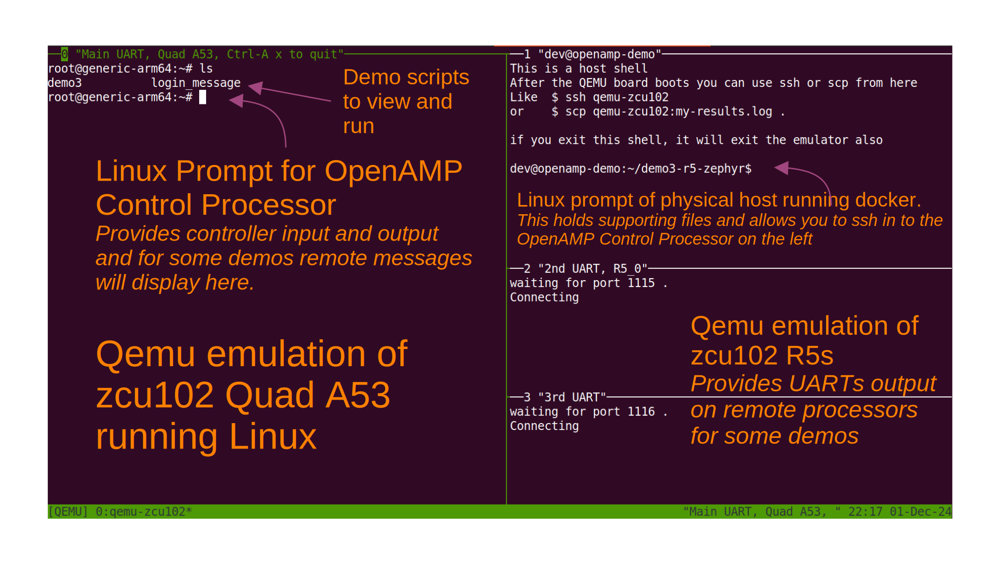

.. _docker-images-label:

==========================
OpenAMP Demo Docker images
==========================

The OpenAMP project maintains the following docker images to demonstrate
the project.

Multiple QEMU instances are run in the docker image to emulate both the
host processor(s) and the remote processor(s) of an OpenAMP system
:ref:`topology<topology-work-label>`.

The :ref:`Supporting Tools<tools_label>` are executed within the docker
container using host scripts and applications.

In the future docker images for use with CI will also be provided.
At this time the following images are provided:

.. list-table:: Docker images
    :widths: 25 75
    :header-rows: 1

    * - Name
      - Description
    * - openamp/demo-lite
      - Just enough to run the OpenAMP QEMU demos and :ref:`supporting tools<tools_label>`, like lopper CLI demo
    * - openamp/demo
      - Placeholder for image *to build* and run the above demos

Docker setup
*********************************

You will need docker on your machine. A docker install from your Linux
distribution or from the official docker project should work fine.

.. warning::
   Arm64 host machines (like a MacBook with Apple Silicon instead of x86 ) are
   not tested at this time.  Binary translation may or may not work.
   An aarch64 docker image will be provided in the future.

Some quick start information is given below but also checkout the
docker cheat-sheet at the end of this document.

Docker quick start for Ubuntu
-----------------------------

Example for Ubuntu 20.04 or 22.04:

::

    $ sudo apt update; sudo apt install docker.io; sudo adduser $USER docker

Then **logout** and **log back in** in order to get the new group.
You can check your groups with the command:

::

    $ groups

.. warning::
    If you cannot add yourself to the docker group, you can run docker with ``sudo``
    but doing so with *any* docker image is not recommended based on general
    security best practice.  There is nothing in the OpenAMP images that should
    make them more dangerous than other images.

Your life will be easier if you are not behind a corporate firewall.
However if you can pull the docker image you should be able to run the demos
as they are self contained.  Some of the other activities described like
installing new packages etc may not work without additional effort.
If needed, please checkout `this tutorial <https://www.serverlab.ca/tutorials/containers/docker/how-to-set-the-proxy-for-docker-on-ubuntu/>`_.

Docker for other host systems
-----------------------------

There are a ton of tutorials for installing and using docker on the web.
Some good ones include:

    - `Official docker documentation <https://docs.docker.com/desktop/>`_
    - `Digital Ocean tutorial <https://www.digitalocean.com/community/tutorials/how-to-install-and-use-docker-on-ubuntu-20-04>`_

Start the container
*******************

The demos should be started using docker run in `interactive mode <https://docs.docker.com/reference/cli/docker/container/run/#interactive>`_ with `pseudo-tty <https://docs.docker.com/reference/cli/docker/container/run/#tty>`_.

::

    you@your-machine:~$ docker run -it openamp/demo-lite

This will pull the openamp/demo-lite image to your machine if it is not already
there.  If it is there it will be used without checking if it is the latest.

It will then create and start a container based on this image and attach to it.

.. _start-docker-demos:

Start Docker Demos using Container
^^^^^^^^^^^^^^^^^^^^^^^^^^^^^^^^^^

You will now be at a command prompt inside the container.
As part of logging you in, some guidance will be printed on how to run the demos.

::

    Welcome to the OpenAMP demo (lite version)
    You can run the demos by using
        $ qemu-zcu102 demo1
    Where demo1 is any of demo1 demo2 demo3 or demo4
    You can also run the lopper demo like
        $ ./demo5/demo5

    Enjoy!
    dev@openamp-demo:~$

To :ref:`exit the docker container<exit_docker>` use key combination Ctrl-A x
on window 0 (left tmux pane) or type exit on window 1 (top right tmux pane).

We also recommend reading :ref:`Qemu Tips and Tricks<qemu-tips-tricks>` to help
you during execution of demos.

QEMU Demos Layout
*****************

The QEMU demos have a consistent terminal layout utilizing
`tmux <https://en.wikipedia.org/wiki/Tmux>`_, which is a terminal multiplexer,
allowing for multiple terminals to be displayed on a single window.

In the figure above the orange text is informative and the white is what is
actually displayed by the docker image parts.

There are four tmux panes. The left most larger pane is the Linux prompt
for the OpenAMP demonstration's controller/host processor (not to be confused
with the docker host). This is where each of the demo scripts are provided
(in the home folder) to be executed. This pane is also where all of the
input and output is performed.

The top right tmux pane is the docker host pane, which holds the supporting
files like firmware images (in a directory called my-extra-stuff) and allows
you to ssh into the A53 control processor Linux instance (left most tmux
pane).

The two bottom right panes are for the UART output of the two zcu102 R5s.

Run the QEMU based demos
************************

To run demo1, use the following command:

::

    dev@openamp-demo:~$ qemu-zcu102 demo1

This will:

    - Build a custom cpio file for the tftp/zcu102 directory
        * This cpio will contain the contents of the base cpio file plus the contents of the my-extra-stuff directory
        * This is done every boot so changes to the my-extra-stuff directory will be used on the next boot
        * You can view the contents of the my-extra-stuff directory in the top right 'host' pane of tmux. It contains a lib folder with firmware files and a /home/root directory with the demo scripts and login_message displayed on start.
    - Start tmux and create multiple panes
        * The main QEMU pane with the main UART
        * A "host" pane for container level commands
        * Two additional UART panes
    - QEMU will:
        * Emulate the four A53 CPUs and the two R5 CPUs
        * In a separate QEMU process, emulate the microblaze based PDU
    - The A53s (in main QEMU pane) will:
        * Run TrustedFirmware-A, and U-Boot
        * U-boot will autoboot from TFTP (provided by QEMU from the tftp directory)
        * Load and run the kernel, dtb, and cpio based initramfs
        * present a login prompt
    - The container shell pane will present a container prompt
    - The 2nd and 3rd UART panes will
        * wait for QEMU to start
        * connect to the other UARTs of the emulated SOC
        * The 2nd UART is not used by demo 1 & 2 but is used by demo 3 & 4
        * The 3rd UART is not currently used

Let the SOC autoboot (don't stop at the U-boot count down) and then login as
directed (user is root with no password).
If you don't see the login prompt hit enter to get a fresh prompt.
At SOC login (left tmux pane), instructions will be printed for running the
current demo.

The following snippet shows the login followed by the login_message
printed immediately after login.

::

    Poky (Yocto Project Reference Distro) 4.0 generic-arm64 /dev/ttyPS0

    (Login as root with no password)
    generic-arm64 login: root
    This is demo1, rpmsg examples on R5 lockstep
    There are 3 sub-demos here: demo1A demo1B and demo1C
    Look at them
    $ cat demo1A
    or just run them
    $ ./demo1A

    root@generic-arm64:~#

Demo1 contains 3 sub-demos, ``demo1A``, ``demo1B`` and ``demo1C``.
You should look at each before running it.

The subsequent snippets show and then run demo1A script, followed by
the outputs.

Display script:

::

    root@generic-arm64:~# cat ./demo1A
    #!/bin/sh

    R5_0=/sys/class/remoteproc/remoteproc0

    echo "Make sure the R5 is not running"
    echo stop >$R5_0/state 2>/dev/null

    echo "Set the firmware to use"
    echo image_echo_test_zcu102 >$R5_0/firmware

    echo "Start the R5"
    echo start >$R5_0/state

    echo "Now run the echo test Linux application"
    echo_test

and then run it:

::

    root@generic-arm64:~# ./demo1A
    Make sure the R5 is not running
    Set the firmware to use
    Start the R5
    [  809.815718] remoteproc remoteproc0: powering up ff9a0000.rf5ss:r5f_0
    [  809.818340] remoteproc remoteproc0: Booting fw image image_echo_test_zcu102, size 610856
    main():98[  op 8enamp l09.833571ib v]  remotersion: eproc0#v1.dev0buffe1.0 (r: registered virtio0 (type 7)
    main():99 Major: 1, main():100 Minor: 1, main():101 Patch: 0)
    [  809.833965] remoteproc remmain()ote:103 libmetal libpro version: c0: 1.1.remot0 (e processor ff9maina0000.rf5s():104 Major: 1, s:r5f_0 mais innow up
    ():105 Minor: 1, main():106 Patch: 0)
    main():108 Starting application...
    0 L7 registered generic bus

Note that the output above shows both the Linux control processor output as
well as the remote processor output interleaved so can be muddled in places.

[snip]
::

    sending payload number 470 of size 487
    echo test: sent : 487
    received payload number 470 of size 487

    sending payload number 471 of size 488
    echo test: sent : 488
    received payload number 471 of size 488

    **************************************

    Echo Test Round 0 Test Results: Error count = 0

    **************************************
    18 L6 rpmsg_endpoint_cb():36 shutdown message is received.
    19 L7 app():82 done
    [  814.610677] virtio_rpmsg_bus virtio0: 20 L6 main():129 Stopdestroyiping ang channelpp rlication.pm..
    sg-openamp-demo-channel addr 0x400
    21 L7 unregistered generic bus

Do the same for ``demo1B`` and ``demo1C``.

To exit QEMU do either one of these:

    - In QEMU pane, hit **Ctrl-A** and then **x**
    - Click the "host" shell pane and type the ``exit`` command

Now do the same for the other demos. You need to first
:ref:`exit docker<exit-docker>` and then
:ref:`start docker run<start-docker-demos>` for ``demo2``, ``demo3``, and
``demo4``.
These demos do not have sub-demos so contain a single demo script.

Run the Lopper CLI demo
***********************

The Lopper demo is fairly standalone but the container already has the
needed requirements and the git repository has already been cloned with
the correct branch. Additionally, scripts have been written to cut down the
typing or cut-and-paste required.

Note that this demo is a :ref:`Supporting Tools<tools_label>` demo so does
not use qemu-zcu102 like the previous demos. Instead the demo is run directly
to start the corresponding container.

To run this demo use:

::

    dev@openamp-demo:~$ ./demo5/demo5

The script will first give the URL of the README file.  You should open this URL
in a browser and follow along.

The script will then step you through the commands in the README and let you
view the various files.  At the end you can look at all the files in the
~/demo5/lopper/demos/openamp directory.

Refer to the :ref:`Lopper Intro<lopper-tool-intro>` for details.

.. _exit-docker:

Exit and clean-up the docker container
**************************************

When at the docker container prompt (window 1 at top right of terminal), the exit
command will stop the container and return you to your machine's prompt.

::

    dev@openamp-demo:~$ exit
    you@your-machine:~$

Alternately type Ctrl-A x to quit, as instructed on window 0, top left of the terminal.

Now the container is not running but still exists.  To check and delete it do:
::

    you@your-machine:~$ docker ps -a
    CONTAINER ID   IMAGE               COMMAND                  CREATED       STATUS                      PORTS     NAMES
    nnnnnnnnnnnn   openamp/demo-lite   "/bin/sh -c 'su -l d…"   2 hours ago   Exited (0) 36 seconds ago             random_name
    nnnn openamp/demo-lite "bash"  Exited (0) 2 minutes ago random_name
    dev@openamp-demo:~$ docker rm random_name

.. note::
    You can use tab completion to fill in the random name assigned to
    the container

The reusable docker image still exists on your machine.
To see the images and delete the the openamp ones, you can do:

::

    you@your-machine:~$ docker image list
    openamp/demo-lite   latest        6ee85d920453   24 hours ago   837MB
    you@your-machine:~$ docker image rm openamp/demo-lite

.. _qemu-tips-tricks:

qemu-zcu102 tips and tricks
***************************

Some help is available with ``qemu-zcu102 help`` but it is not yet complete.

tmux mouse mode is turned on.  You can:

    - click in a pane to give it focus
    - hold the right mouse button to show a menu (zoom and un-zoom are useful)
    - the mouse scroll wheel will scroll the pane, use ``q`` to exit this mode
    - if you don't need the 2nd or 3rd UART pane, you can kill them with the right button menu
    - you can drag the pane borders to resize the panes
    - you can kill the container host pane w/o stopping QEMU

The container host pane can be used with ``ssh`` to connect with the
emulated SOC or with ``scp`` to transfer files.
SSH configuration is already setup for the name ``qemu-zcu102``.

From the container host pane:

::

    dev@openamp$ ssh qemu-zcu102
    root@generic-arm64:~# exit
    dev@openamp$ date >date.txt; scp date.txt qemu-zcu102:
    dev@openamp$ ssh qemu-zcu102 cat date.txt

You can manually send output to the 2nd UART like so:

::

    root@generic-arm64:~# echo “Hello there” >/dev/ttyPS1

Docker cheat-sheet
******************

First some tips specific to the OpenAMP demo containers

The container is based on the standard Ubuntu 20.04 docker image.
Like the Ubuntu standard images it is minimized (no man pages etc).
However bash completion has been added.

There is no init system running (no systemd, no sysvinit) so no daemons are
running.  You cannot ssh into the container nor use scp between your host and
the container.  You can use ``docker cp`` and ``docker attach`` in
a fashion *similar* to ``scp`` and ``ssh`` respectively.

You have no password required sudo access as the ``dev`` user.  You can update
and install packages if you wish.

All of the below are standard docker usage but may be helpful to people less
familiar with docker.

You can add ``--rm`` to the ``docker run`` command to automatically delete the
container when you exit.
You cannot change your mind while running the container so do this only if
you are sure you do not want to reuse the changes you made in the container.
This will not delete the image, just the container.

To restart and reattach to a container that is stopped, do this
(tab completion will help with the random name):

::

    you@your-machine:~$ docker start random_name
    you@your-machine:~$ docker attach random_name

To detach from a container without stopping it, you can use ``Ctrl-p Ctrl-q``.
To reattach use the attach command as show above.

``docker ps`` will show all running containers and ``docker ps -a`` will
show all containers running or stopped
