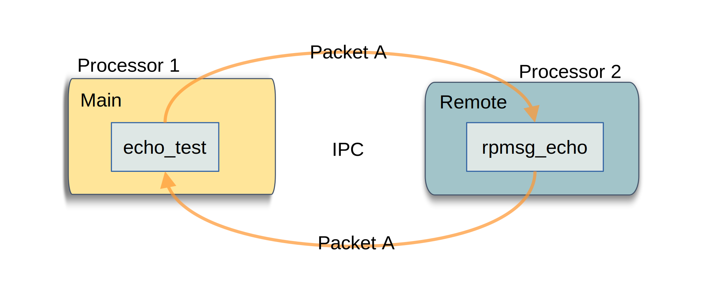
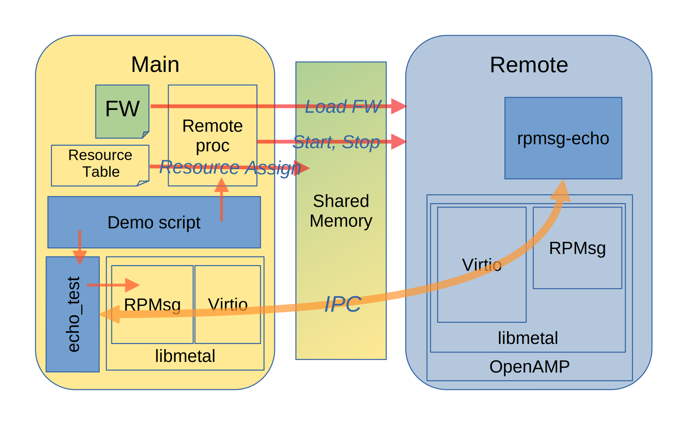

========================
OpenAMP Echo Test Sample
========================

.. _echo-test-intro:

***************
Echo Test Intro
***************

The echo test reference sample, as the name suggests, demonstrates OpenAMP
:ref:`Interprocessor Communications (IPC)<ipc-work-label>` components by providing an echo
application on a remote which simply returns (echoes) packets as they are received at an
:ref:`RPMsg endpoint <rpmsg-endpoint>` from the main controller. The main controller then verifies
the returned packet for integrity.

.. _echo-test-components:

********************
Echo Test Components
********************

There are two applications involved in this demonstration.
The :ref:`remote application<echo-test-remote-app>` runs as an echo service, which returns packets
it receives on an :ref:`RPMsg endpoint <rpmsg-endpoint>`.
The :ref:`main controller application<echo-test-host-app>` is the test application sending packets
to the echo service and monitoring for their return.

The underlying OpenAMP architectural components used by these applications are

* :ref:`Remoteproc<overview-remoteproc-work-label>`
* :ref:`Resource Table<overview-remoteproc-work-label>`
* :ref:`RPMsg<overview-rpmsg-work-label>`
* :ref:`Virtio<overview-rpmsg-work-label>`
* :ref:`Libmetal<overview-proxy-libmetal-label>`

The following architecture diagram shows the components involved in the demonstration.

The top-level control flow is shown in the following message diagram.

.. _echo-test-control-flow:

.. _echo-test-remote-app:

RPMsg Echo Remote Application
=============================

The remote application, rpmsg-echo, is the core of the demonstration. It is a simple application
serving a :ref:`RPMsg endpoint <rpmsg-endpoint>` running as the main task on the remote processor.

.. _echo-test-host-app:

Echo Test Main Application
==========================

The echo_test application forms the main controller side of the demonstration. It repeatedly writes
an increasing length payload of 0xA5's up to the maximum data size (packet size minus header) to the
RPMsg endpoint. Following each packet send, it reads from the same endpoint and verifies the
returned packet for correctness. The application will stop and report on the first corruption found.

Echo Test Main Script
=====================

The main controller is also responsible for loading the firmware containing the
:ref:`RPMsg Echo Remote Application<echo-test-remote-app>` and starting the remote processor using
:ref:`Remoteproc<overview-remoteproc-work-label>`.

For main controllers, like Linux, a script can be used to pipe the firmware to the exposed
remoteproc system, followed by the execution of the user space echo_test application. For
controllers without scripting capability, like baremetal and RTOS (Real Time Operating systems),
this would be achieved in the code.

In the :ref:`Demo Docker Images<docker-images-label>` this is script demo1A.

****************
Echo Test Source
****************

RPMsg Echo Baremetal Source
===========================

The RPMsg Echo service application is available as a baremetal solution in the
`open-amp Repository <https://github.com/OpenAMP/openamp-system-reference/blob/main/examples/legacy_apps/examples/echo/rpmsg-echo.c>`_

It is a CMake application and can be built for any remote as long as the relevant
:ref:`OS/HW abstraction layer<porting-guide-work-label>` components like libmetal are ported for
that platform.

.. _echo-test-linux-app:

Echo Test Linux Source
======================

The echo test Linux application is executed on the Linux main controller as a user space application.
The application is available in the
`OpenAMP System Reference repository <https://github.com/OpenAMP/openamp-system-reference/blob/main/examples/linux/rpmsg-echo-test/echo_test.c>`_.

It is a Makefile application and can be built using the
`Yocto rpmsg-echo-test recipe <https://github.com/OpenAMP/meta-openamp/blob/master/recipes-openamp/rpmsg-examples/rpmsg-echo-test_1.0.bb>`_

An example main control script is given in the
:ref:`echo test readme<openamp-system-reference/examples/linux/rpmsg-echo-test/README:run the demo>`

*******************************
Reference Board Implementations
*******************************

This Echo Test Sample is demonstrated in the following reference implementations.

* :ref:`Docker Images<docker-images-label>` as demo1A
* :ref:`AMD-Xilinx platforms<demos-AMD-work-label>`
* :ref:`Inter Process Demos<inter-process-reference-label>`
