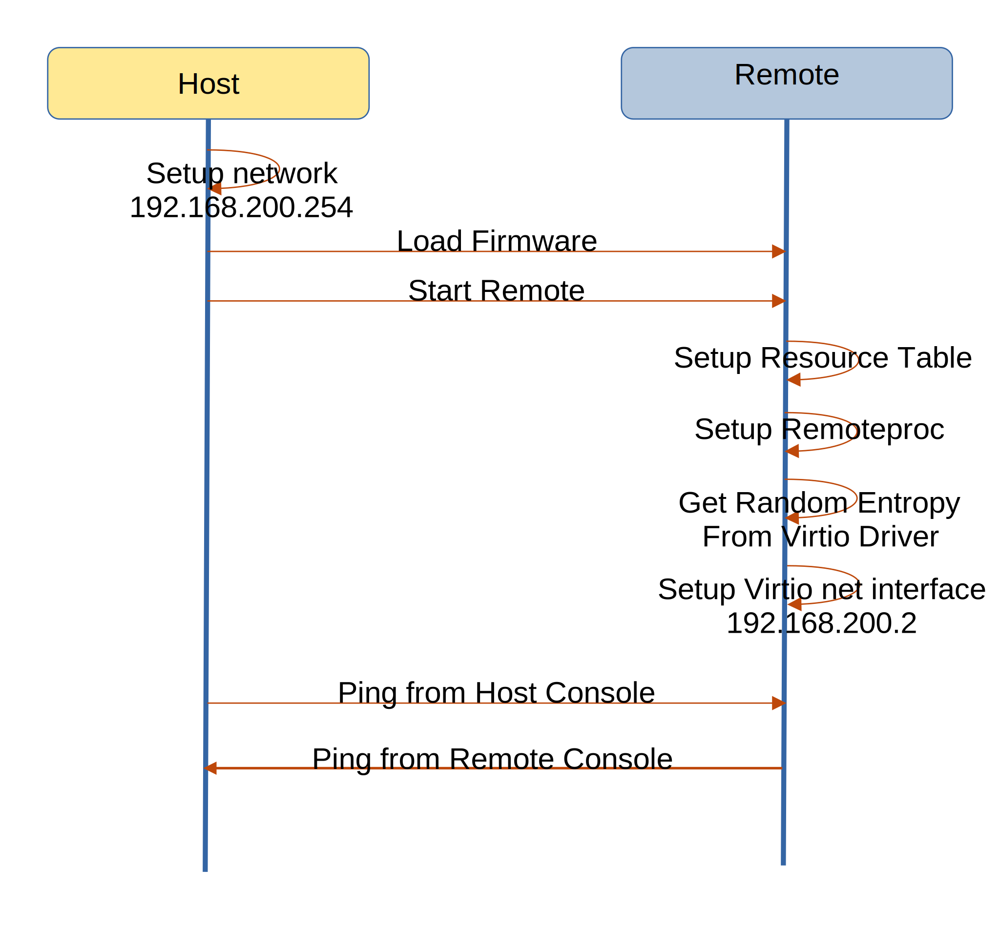

=============================
OpenAMP Hypervisorless Virtio
=============================

.. _hvl-virtio-intro:

***************************
Hypervisorless Virtio Intro
***************************

There are a number of `hypervisorless virtio demos <https://github.com/OpenAMP/zephyr-openamp-staging/tree/virtio-exp/samples/virtio>`_. There intent is to demonstrate the use of :ref:`Virtio<overview-rpmsg-work-label>` component and its associated drivers.
This section details the sample for `hypervisorless virtio with entropy and network devices (hvl_net_rng_reloc) <https://github.com/OpenAMP/zephyr-openamp-staging/tree/virtio-exp/samples/virtio/hvl_net_rng_reloc>`_.

All demonstrations are run on a remote running `Zephyr Operating System (OS) <https://www.zephyrproject.org/>`_.

..  image::  ../images/demos/hvl-virtio-intro.svg

.. _hvl-virtio-components:

********************************
Hypervisorless Virtio Components
********************************

This demonstration uses a single application on the remote.
The :ref:`remote application<hvl-virtio-remote-app>` runs entirely on the remote and does not communicated with the host.

The underlying OpenAMP architectural components used by these applications are

* :ref:`Remoteproc<overview-remoteproc-work-label>`
* :ref:`Resource Table<overview-remoteproc-work-label>`
* :ref:`Virtio<overview-rpmsg-work-label>`
* :ref:`Libmetal<overview-proxy-libmetal-label>`

The following architecture diagram shows the components involved in the demonstration.

..  image::  ../images/demos/hvl-virtio-components.svg

The top-level control flow is shown in the following message diagram.

.. _hvl-virtio-control-flow:

.. _hvl-virtio-remote-app:

Hypervisorless Virtio Remote Application
========================================

The remote application is the core of the demonstration. It is a simple application utilising a number of Virtio drivers, once loaded and started using :ref:`Remoteproc<overview-remoteproc-work-label>`.

Hypervisorless Virtio Host Script
=================================

The host is responsible for loading the firmware containing the :ref:`Hypervisorless Virtio Application Application<hvl-virtio-remote-app>` and starting the remote processor using :ref:`Remoteproc<overview-remoteproc-work-label>`.

For host controllers, like Linux, a script can be used to pipe the firmware to the exposed remoteproc system. For controllers without scripting capability, like baremetal and RTOS (Real Time Operating systems), this would be achieved in the code.

In the :ref:`Demo Docker Images<docker-images-label>` this is script demo4.

****************************
Hypervisorless Virtio Source
****************************

Hypervirsorless Virtio Zephyr Source
====================================

The hypervisorless virtio application is available as a Zephyr solution in the `zephyr-openamp-staging Repository <https://github.com/OpenAMP/zephyr-openamp-staging/tree/virtio-exp/samples/virtio/hvl_net_rng_reloc>`_

It is a CMake application and can be built for any remote as long as the relevant :ref:`OS/HW abstraction layer<porting-guide-work-label>` components like libmetal are ported for that platform.

.. _hvl-virtio-linux-script:

Hypervisorless Virtio Linux Source
==================================

There is no Linux application rather there are some scripts which load and start the remote firmware.
The scripts are available in the :ref:`Demo Docker Images<docker-images-label>` as demo4.

*******************************
Reference Board Implementations
*******************************

This Hypervisorless Virtio Samples are demonstrated in the following reference implementations.

* :ref:`Docker Images<docker-images-label>` as demo1A
* :ref:`AMD-Xilinx platforms<demos-AMD-work-label>`

For information on building and running the demonstrations for zcu102 refer to

.. toctree::
   :maxdepth: 2

   hypervisorless_virtio_zcu102
