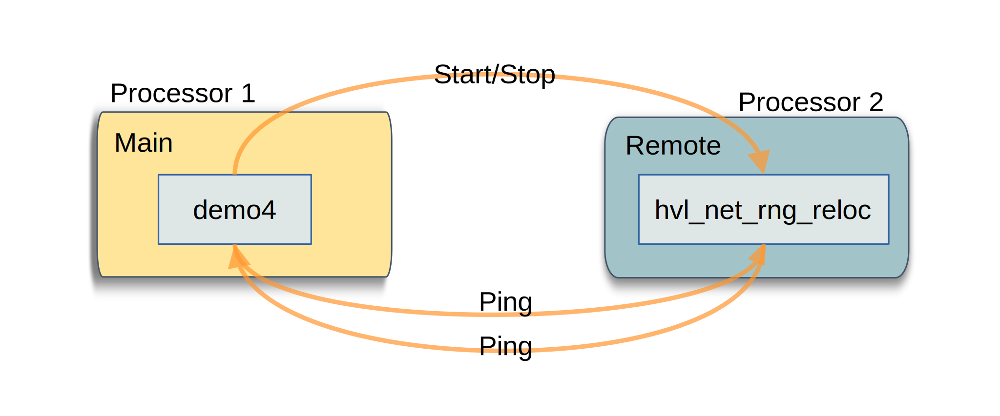
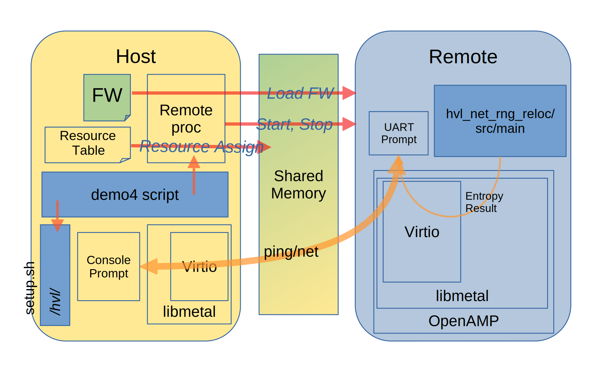
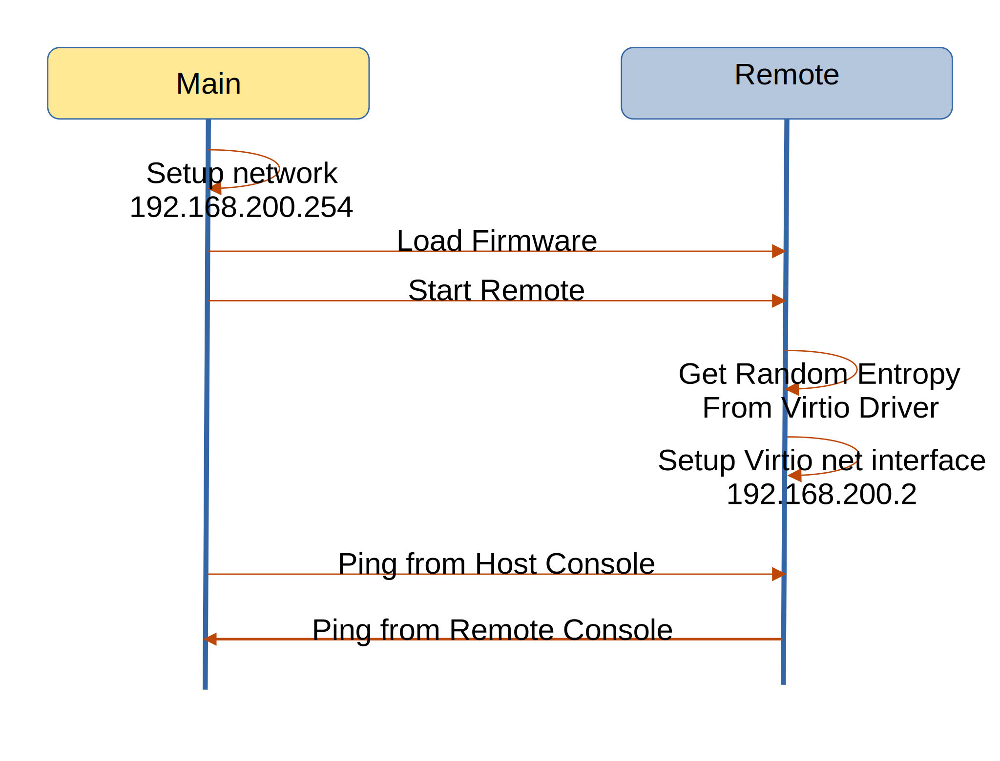

=============================
OpenAMP Hypervisorless Virtio
=============================

.. _hvl-virtio-intro:

***************************
Hypervisorless Virtio Intro
***************************

There are a number of
`hypervisorless virtio demos <https://github.com/OpenAMP/zephyr-openamp-staging/tree/virtio-exp/samples/virtio>`_.
Their intent is to demonstrate the use of the :ref:`Virtio<overview-rpmsg-work-label>` component and associated drivers.

This section details the sample for
`hypervisorless virtio with entropy and network devices (hvl_net_rng_reloc) <https://github.com/OpenAMP/zephyr-openamp-staging/tree/virtio-exp/samples/virtio/hvl_net_rng_reloc>`_.

All demonstrations are run on a remote running `Zephyr Operating System (OS) <https://www.zephyrproject.org/>`_.

.. _hvl-virtio-components:

********************************
Hypervisorless Virtio Components
********************************

This demonstration uses a single application on the remote and a setup and demo script on the main
controller.

The underlying OpenAMP architectural components used by these applications are

* :ref:`Remoteproc<overview-remoteproc-work-label>`
* :ref:`Resource Table<overview-remoteproc-work-label>`
* :ref:`Virtio<overview-rpmsg-work-label>`
* :ref:`Libmetal<overview-proxy-libmetal-label>`

The following architecture diagram shows the components involved in the demonstration.

The top-level control flow is shown in the following message diagram.

.. _hvl-virtio-control-flow:

.. _hvl-virtio-remote-app:

Hypervisorless Virtio Remote Application
========================================

The remote application is the core of the demonstration. It is a simple application utilising a
number of Virtio devices.

The remote application when started initially calls on the
`Virtio Entropy Device <https://docs.oasis-open.org/virtio/virtio/v1.3/csd01/virtio-v1.3-csd01.html#x1-3360004>`_
to obtain entropy values to print to the UART console. Subsequently, it sets up
`Virtio Network Device <https://docs.oasis-open.org/virtio/virtio/v1.3/csd01/virtio-v1.3-csd01.html#x1-2340001>`_
to provide communications between the main controller at 192.168.200.254 and remote at 192.168.200.2.

Hypervisorless Virtio Main Script
=================================

The main controller is responsible for setting up a
`virtual/tap network <https://en.wikipedia.org/wiki/TUN/TAP>`_, loading the firmware containing the
:ref:`Hypervisorless Virtio Application<hvl-virtio-remote-app>` and starting the remote processor
using :ref:`Remoteproc<overview-remoteproc-work-label>`.

The scripts are available in the :ref:`Demo Docker Images<docker-images-label>` as
`demo4 <https://github.com/OpenAMP/openamp-demo/blob/main/demos/demo-hvl-virtio/my-extra-stuff/home/root/demo4>`_
and `setup.sh <https://github.com/OpenAMP/openamp-demo/blob/main/demos/demo-hvl-virtio/my-extra-stuff/hvl/setup.sh>`_.

****************************
Hypervisorless Virtio Source
****************************

Hypervirsorless Virtio Zephyr Source
====================================

The hypervisorless Virtio application is available as a Zephyr solution in the
`zephyr-openamp-staging Repository <https://github.com/OpenAMP/zephyr-openamp-staging/blob/virtio-exp/samples/virtio/hvl_net_rng_reloc/src/main.c>`_.

It is a CMake application and can be built for any remote as long as the relevant
:ref:`OS/HW abstraction layer<porting-guide-work-label>` components like libmetal are ported for
that platform.

.. _hvl-virtio-linux-script:

*******************************
Reference Board Implementations
*******************************

This Hypervisorless Virtio Samples are demonstrated in the following reference implementations.

* :ref:`Docker Images<docker-images-label>` as demo4
* :ref:`AMD-Xilinx platforms<demos-AMD-work-label>`

For information on building and running the demonstrations for zcu102 refer to

.. toctree::
   :maxdepth: 2

   ../hypervisorless_virtio_zcu102/README_demo
