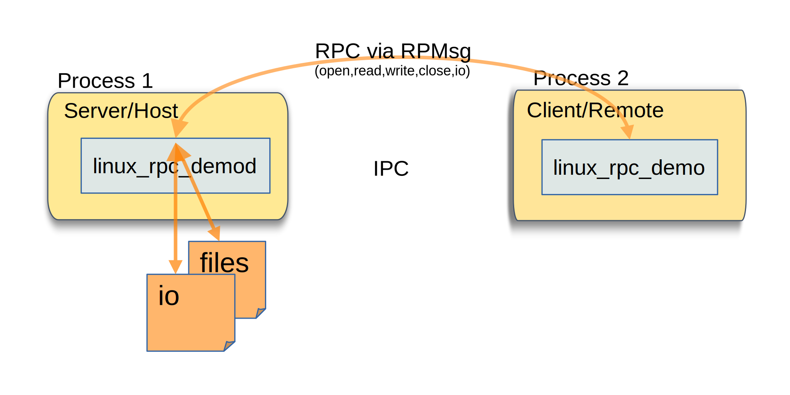
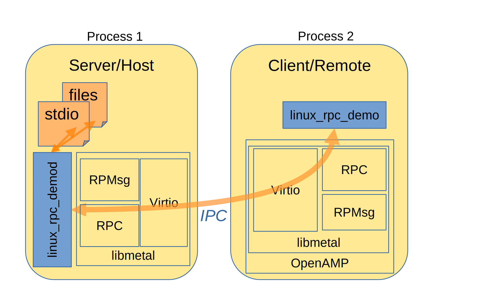
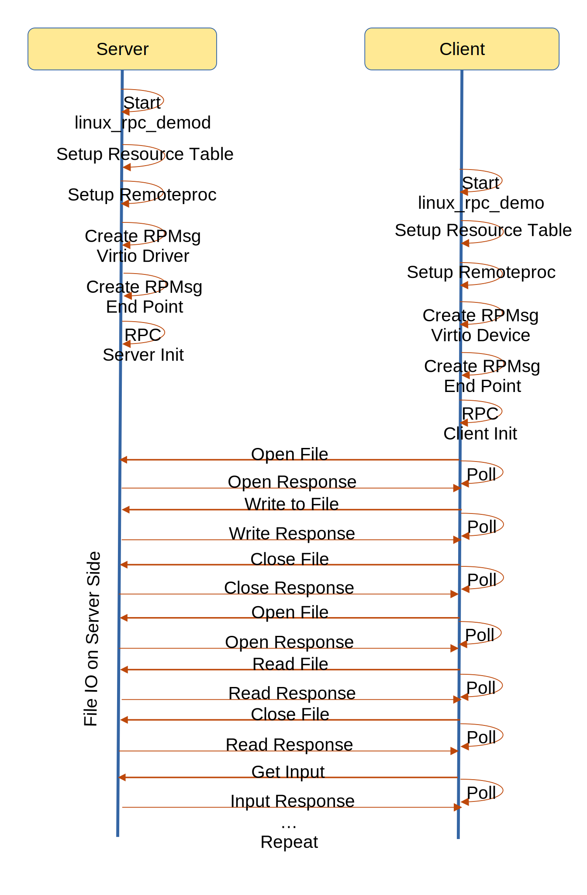

======================
OpenAMP Linux RPC Demo
======================

.. _linux-rpc-intro:

***************
Linux RPC Intro
***************

The RPMsg Multi Services reference sample demonstrates OpenAMP
:ref:`Remote Procedure Call (RPC)<overview-proxy-rpc-work-label>` components between two linux
processors, one as the main controller and the other as remote.

.. _linux-rpc-components:

********************
Linux RPC Components
********************

This demonstration shows how the :ref:`Remote Procedure Call (RPC)<overview-proxy-rpc-work-label>`
component is a shim over RPMSg providing the familiar Input/Output (IO) commands like open, read,
write, close both for files and standard input/output.

The underlying OpenAMP architectural components used by these applications are

* :ref:`Remoteproc<overview-remoteproc-work-label>`
* :ref:`Resource Table<overview-remoteproc-work-label>`
* :ref:`RPMsg<overview-rpmsg-work-label>`
* :ref:`Virtio<overview-rpmsg-work-label>`
* :ref:`RPC<overview-proxy-rpc-work-label>`
* :ref:`Libmetal<overview-proxy-libmetal-label>`

The Linux file and stdio access is performed in the
`linux_rpc_demod application <https://github.com/OpenAMP/openamp-system-reference/blob/main/examples/legacy_apps/examples/linux_rpc_demo/linux_rpc_demod.c>`_.

The following architecture diagram shows the primary components involved in the demonstration.

.. _linux-rpc-control-flow:

The top-level control flow is shown in the following message diagram.

.. _linux-rpc-server:

Linux RPC Server
================

The Linux RPC Server application is a file handling server and achieves this by providing a shim
over the RPC component of OpenAMP, with pointers, and associated identifiers for each of the file IO
functions like open, close, read write, and input for stdio.

Whenever the server receives an RPMsg on this end point with the associated identifier it will
perform the file IO on behalf of the client/remote.

.. _linux-rpc-client:

Linux RPC Client
================

The Linux RPC Client application is a remote/client application requiring file handling, but lacking
a file system. Instead it relies on a main server to provide the file handling via RPMsg. It
initializes an RPC client, associated through the server identifiers. For each IO handler it will
send an RPMsg on the associated endpoint.

The OpenAMP RPC client does not block to await the RPMsg response, leaving this to the application
to perform. In the sample client this is performed for each of the input output functions.

*********************
Linux RPC Demo Source
*********************

Linux RPC Server Source
=======================

The current implementation is a Linux process
`linux_rpc_demod <https://github.com/OpenAMP/openamp-system-reference/blob/main/examples/legacy_apps/examples/linux_rpc_demo/linux_rpc_demod.c>`_,
which can be run as a daemon to provide the main controller/driver side of the demonstration.

Linux RPC Client Source
=======================

The current implementation is a Linux process
`linux_rpc_demo <https://github.com/OpenAMP/openamp-system-reference/blob/main/examples/legacy_apps/examples/linux_rpc_demo/linux_rpc_demo.c>`_

*******************************
Reference Board Implementations
*******************************

This Linux RPC Sample is demonstrated in the following reference implementations.

* :ref:`Linux Inter Process <inter-process-reference-label>`

.. toctree::
   :maxdepth: 1
   :caption: Demo Compile and Execution Instructions

   ../open-amp/apps/examples/linux_rpc_demo/README
