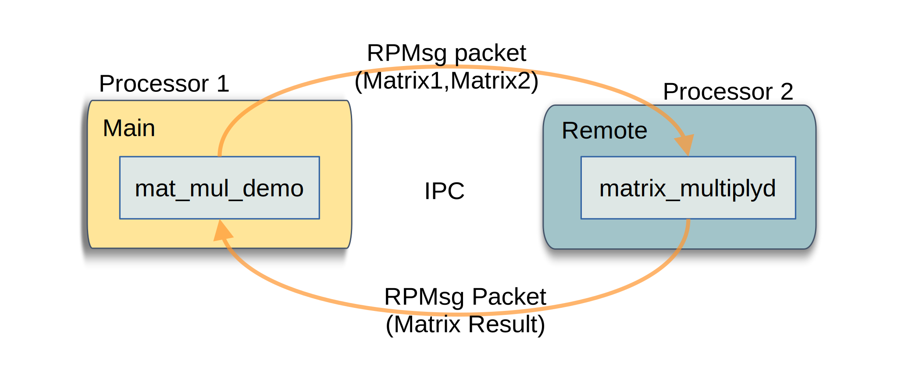
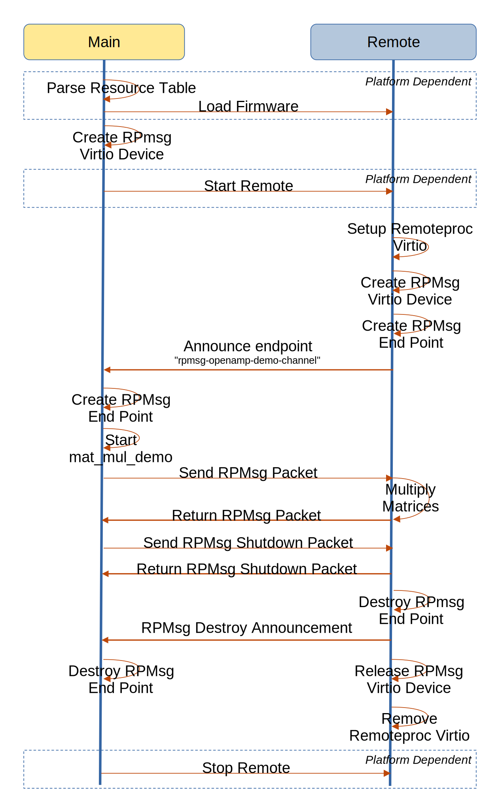

==============================
OpenAMP Matrix Multiply Sample
==============================

.. _matrix-multiply-intro:

*********************
Matrix Multiply Intro
*********************

The matrix multiply reference sample, as the name suggests, demonstrates OpenAMP
:ref:`Interprocessor Communications (IPC)<ipc-work-label>` components through matrix multiplication.
The demonstration uses a main controller client, which generates random matrices. It sends them to a
service/daemon on a remote which performs a matrix calculation and returns the result via a
:ref:`RPMsg endpoint <rpmsg-endpoint>`. The main controller then writes the matrix result to console
output.

.. _matrix-multiply-components:

**************************
Matrix Multiply Components
**************************

There are two applications involved in this demonstration.
The :ref:`remote application<matrix-multiply-remote-app>` runs as an daemon/service which performs a
matrix calculation and returns the result on an :ref:`RPMsg endpoint <rpmsg-endpoint>`.
The :ref:`main controller application<matrix-multiply-host-app>` is the client application sending
two matrices as a packet to the daemon/service and monitoring for the return result.

The underlying OpenAMP architectural components used by these applications are

* :ref:`Remoteproc<overview-remoteproc-work-label>`
* :ref:`Resource Table<overview-remoteproc-work-label>`
* :ref:`RPMsg<overview-rpmsg-work-label>`
* :ref:`Virtio<overview-rpmsg-work-label>`
* :ref:`Libmetal<overview-proxy-libmetal-label>`

The following architecture diagram shows the components involved in the demonstration.

The top-level control flow is shown in the following message diagram.

.. _matrix-multiply-remote-app:

RPMsg Matrix Multiply Remote Application
========================================

The remote application,
`matrix_multiplyd <https://github.com/OpenAMP/openamp-system-reference/blob/main/examples/legacy_apps/examples/matrix_multiply/matrix_multiplyd.c>`_,
is the core of the demonstration. It is a simple application serving a
:ref:`RPMsg endpoint <rpmsg-endpoint>` running as the main task on the remote processor.

.. _matrix-multiply-host-app:

Matrix Multiply Main Application
================================

The main controller application generates two matrices into a structure with size and 6x6 matrix,
sequentially into a RPMsg packet. It then waits for matrix sized bytes to be returned and prints the
resultant matrix as calculated by the remote.

There are two implementations. The
`mat_mul_demo <https://github.com/OpenAMP/openamp-system-reference/blob/main/examples/linux/rpmsg-mat-mul/mat_mul_demo.c>`_
application forms the main controller side of the demonstration, as a linux user space client
application. The
`matrix_multiply <https://github.com/OpenAMP/openamp-system-reference/blob/main/examples/legacy_apps/examples/matrix_multiply/matrix_multiply.c>`_
application forms the main controller side of the demonstration, as a baremetal client application.

Matrix Multiply Main Script
===========================

The main controller is also responsible for loading the firmware containing the
:ref:`RPMsg Matrix Multiply Remote Application<matrix-multiply-remote-app>` and starting the remote
processor using :ref:`Remoteproc<overview-remoteproc-work-label>`.

For main controllers, like Linux, a script can be used to pipe the firmware to the exposed
remoteproc system, followed by the execution of the user space mat_mul_demo application. For
controllers without scripting capability, like baremetal and RTOS (Real Time Operating systems),
this would be achieved in the code.

**********************
Matrix Multiply Source
**********************

RPMsg Matrix Multiply Baremetal Sources
=======================================

There are two baremetal applications, a daemon/service to run on the remote and a main controller
application which is the matrix multiply client requesting the calculations.

The RPMsg Matrix Multiply daemon/service application is available as a baremetal solution in the
`OpenAMP Repository <https://github.com/OpenAMP/openamp-system-reference/blob/main/examples/legacy_apps/examples/matrix_multiply/matrix_multiplyd.c>`_.
Take note of the d for daemon at the end of the file.

The RPMsg Matrix Multiple main controller client application is available as a baremetal solution in
the `OpenAMP Repository <https://github.com/OpenAMP/openamp-system-reference/blob/main/examples/legacy_apps/examples/matrix_multiply/matrix_multiplyd.c>`_.

Both are CMake applications and can be built for any remote as long as the relevant
:ref:`OS/HW abstraction layer<porting-guide-work-label>` components like libmetal are ported for that
platform.

.. _matrix-multiply-linux-app:

Matrix Multiply Linux Source
============================

The matrix multiply Linux application is executed on the Linux main controller as a user space
application.
The application is available in the
`OpenAMP System Reference repository <https://github.com/OpenAMP/openamp-system-reference/blob/main/examples/linux/rpmsg-mat-mul/mat_mul_demo.c>`_.

It is a Makefile application and can be built using the
`Yocto rpmsg-mat-mul recipe <https://github.com/OpenAMP/meta-openamp/blob/master/recipes-openamp/rpmsg-examples/rpmsg-mat-mul_1.0.bb>`_.

An example main control script is given in the
`matrix multiply readme <https://github.com/OpenAMP/openamp-system-reference/tree/main/examples/linux/rpmsg-mat-mul#run-the-demo>`_.

*******************************
Reference Board Implementations
*******************************

This Matrix Multiply Sample is demonstrated in the following reference implementations.

* :ref:`Docker Images<docker-images-label>` as demo1B
* :ref:`AMD-Xilinx platforms<demos-AMD-work-label>`
* :ref:`Inter Process Demos<inter-process-reference-label>`
