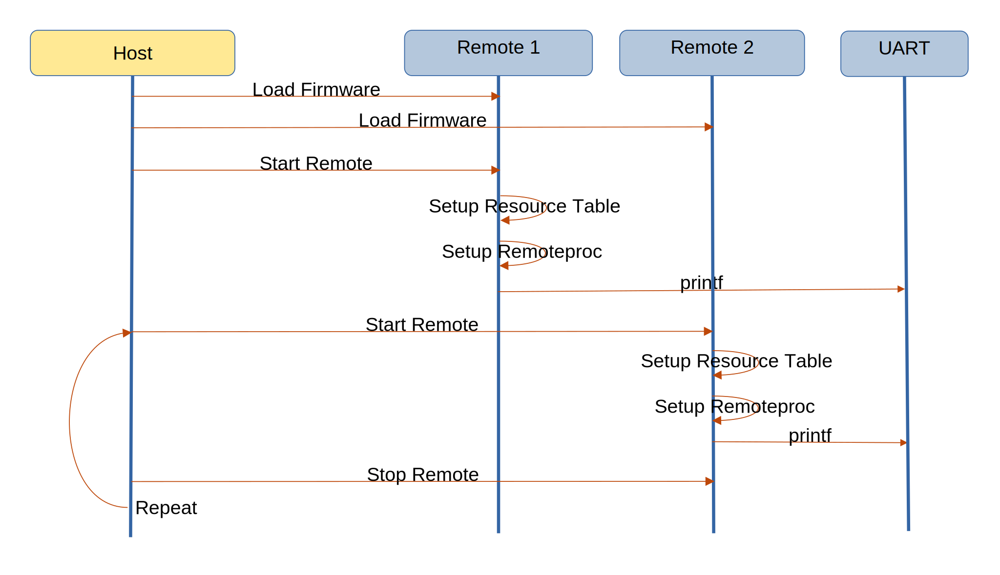

===============================
OpenAMP Replicate Firmware Demo
===============================

.. _replicate-firmware-intro:

************************
Replicate Firmware Intro
************************

The Replicate Firmware Demo is provided to demonstrate the use of two remote processors each loaded with the same firmware.

.. _replicate-firmware-components:

*****************************
Replicate Firmware Components
*****************************

This demonstration uses a single application, sent independently to the two remotes, utilising a demo script on the main controller.

The underlying OpenAMP architectural components used by these applications are

* :ref:`Remoteproc<overview-remoteproc-work-label>`
* :ref:`Resource Table<overview-remoteproc-work-label>`
* :ref:`Libmetal<overview-proxy-libmetal-label>`

The following architecture diagram shows the components involved in the demonstration.

The top-level control flow is shown in the following message diagram.

.. _replicate-firmware-control-flow:

.. _replicate-firmware-remote-app:

Replicate Firmware Remote Application
=====================================

The remote application is a hello world application, which once loaded calls printf. The output of
printf is directed to a UART.

.. _replicate-firmware-linux-script:

Replicate Firmware Main Script
==============================

The main controller is responsible for loading the firmware and starting the remote processors by
writing start and stop to /sys/class/remoteproc/remoteproc0 and /sys/class/remoteproc/remoteproc1 alternately.

The same firmware is loaded, and this is made possible as the system uses
`Tightly Coupled Memory <https://docs.amd.com/r/en-US/ug1085-zynq-ultrascale-trm/Tightly-Coupled-Memory-Functional-Description>`_,
so each processor is assigned its own bank of memory.

The script is available in the :ref:`Demo Docker Images<docker-images-label>` as demo3.

Replicate Firmware Main Configuration
=====================================

The remoteproc configuration binding
`cluster-mode <https://github.com/torvalds/linux/blob/master/Documentation/devicetree/bindings/remoteproc/xlnx%2Czynqmp-r5fss.yaml#L37>`_
is set to 0 for split-mode as per the
`system reference implementation <https://github.com/OpenAMP/openamp-system-reference/blob/main/examples/linux/dts/xilinx/zynqmp-split.dtso>`_.

********************************************
Replicate Firmware Remote Application Source
********************************************

Replicate Firmware Zephyr OS Source
===================================

The application is implemented for Zephyr OS as `hello_world <https://github.com/OpenAMP/zephyr-openamp-staging/tree/main/samples/hello_world>`_.

*******************************
Reference Board Implementations
*******************************

This Replicate Firmware Samples are demonstrated in the following reference implementations.

* :ref:`Docker Images<docker-images-label>` as demo3
