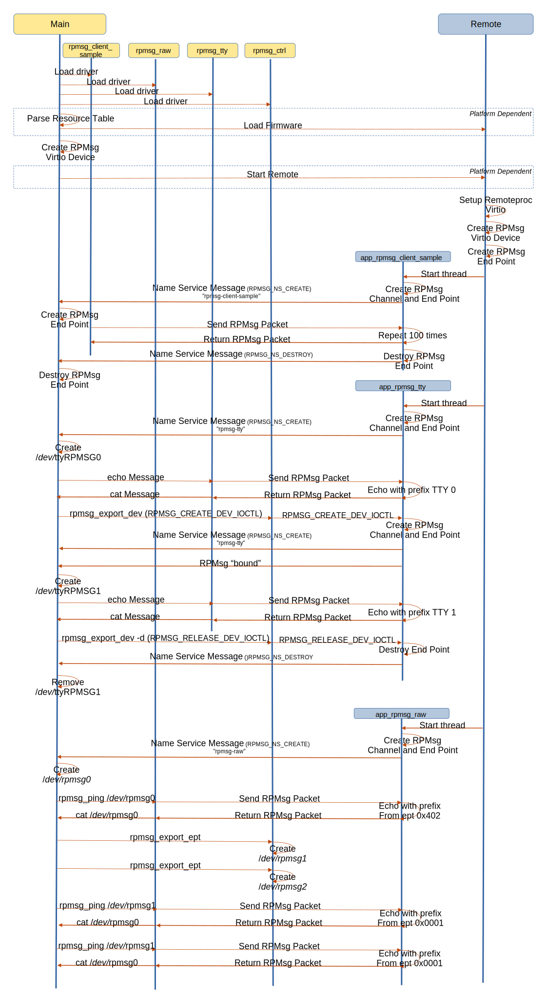

=================================
OpenAMP RPMsg Multi Services Demo
=================================

.. _rpmsg-multi-services-intro:

**************************
RPMsg Multi Services Intro
**************************

The RPMsg Multi Services reference sample demonstrates OpenAMP :ref:`Interprocessor Communications (IPC)<ipc-work-label>` components by providing multiple services on a single remote.

Three channel types are demonstrated.

* Direct RPMsg Channel
* Raw `character device <https://linux-kernel-labs.github.io/refs/heads/master/labs/device_drivers.html>`_ Channel
* `tty Device <https://www.kernel.org/doc/html/latest/driver-api/tty/index.html>`_ Channel

The main controller side is implemented in Linux as client drivers to the remote services. The Direct RPMsg driver is a dedicated demo driver and the character and tty RPMsg drivers are generic character drivers that can be used by any user space application through their respective device files.

The remote sets up three RPMsg channels, one for each service, starting at address RPMSG_RESERVED_ADDRESSES, which is 0x400 (1024). These channels are multiplexed on a single Virtio device.

.. _rpmsg-multi-services-components:

*******************************
RPMsg Multi Services Components
*******************************

The three :ref:`Interprocessor Communications (IPC)<ipc-work-label>` paths in this demonstration provide an identical application flow, namely a main controller based client sending packets via RPMsg to the remote which echoes the packet.

The main target of the demonstration is to show the different RPMsg types as supported by Linux drivers, namely 'direct', 'character' and 'tty' driver.

The underlying OpenAMP architectural components used by these applications are

* :ref:`Remoteproc<overview-remoteproc-work-label>`
* :ref:`Resource Table<overview-remoteproc-work-label>`
* :ref:`RPMsg<overview-rpmsg-work-label>`
* :ref:`Virtio<overview-rpmsg-work-label>`
* :ref:`Libmetal<overview-proxy-libmetal-label>`

The supporting Linux architectural components used by the drivers on the main controller side are

* `RPMsg character device <https://linux-kernel-labs.github.io/refs/heads/master/labs/device_drivers.html>`_
* `tty device <https://www.kernel.org/doc/html/latest/driver-api/tty/index.html>`_

The following architecture diagram shows the components involved in the demonstration.

.. _rpmsg-control-flow-label:

The top-level control flow is shown in the following message diagram. The control flow for each service is exemplified in the three boxes labeled A, B and C for the drivers direct, tty and character/raw.
The remote threads are shown sequentially for clarity of diagram but could be executed in parallel.

.. _rpmsg-client-sample-label:

RPMsg Client Sample
===================

The Linux rpmsg_client_sample driver begins sending 'hello world!' messages on a rpmsg_driver probe, initiated by a name service announcement from the remote. This is repeated a predefined count times for each response from the remote. The response from the remote application is to return the same packet received at the :ref:`RPMsg endpoint <rpmsg-endpoint>` of the main controller.

When the count (100) responses have been sent, the endpoint is destroyed by the remote.

Refer to box A (direct) in :ref:`flow control diagram<rpmsg-control-flow-label>`.

.. _rpmsg-character-driver-sample-label:

Character Driver Samples
========================

The Linux character and tty driver are demonstrated by sending messages to the rpmsg_char and rpmsg_tty driver respectively by a user space command writing to the respective /dev/rpmsg? and /dev/ttyRPMSG? device files. The response is output by using the Linux cat command.

Writing data to the zeroth index /dev/rpmsg0 and /dev/ttyRPMSG0 files will result in an RPMsg being sent to the channel's address, which start at 0x400 (1024) and are allocated by the remote sequentially on channel creation.

Writing data to indexed driver files will result in an RPMsg being sent the Linux endpoint address, which has a corresponding address on the remote side in either a one to one or many to one relationship as detailed in the following sections.

.. _rpmsg-raw-driver-label:

Raw Character Driver Sample
---------------------------

When started, the character/raw remote service (app_rpmsg_raw thread) creates two RPMsg endpoints. The first with the special RPMSG_ADDR_ANY (-1) address which sets up the RPMsg channel and the second with destination and source address set to 1.

In addition to demonstrating the use of the raw character driver, this application demonstrates the use of an arbitrary number of Linux side RPMsg endpoints, all connected to a single endpoint on the remote side (with address 1). The Linux side end points are created using the `rpmsg-utils rpmsg_export_ept utility <https://github.com/OpenAMP/openamp-system-reference/blob/main/examples/linux/rpmsg-utils/rpmsg_export_dev.c>`_, and establish a many to one connectivity between main controller and remote endpoints.

Although there are many endpoints on the Linux side, the remote has only two endpoints.

Refer to box C (char) in :ref:`flow control diagram<rpmsg-control-flow-label>`.

.. _rpmsg-tty-driver-label:

Tty Driver Sample
-----------------

When started, the tty remote service (app_rpmsg_tty thread) initially creates only a single RPMsg channel by creating the special RPMSG_ADDR_ANY (-1) end point.

The management thread (rpmsg_mng_task) also sets up a 'New Service Callback' (new_service_cb) which monitors for new 'rpmsg-tty' requests. On receipt of such a request the application creates a new channel, and returns a "bound" message. The remote application limits this to two channels.

This application demonstrates the creation and release of RPMsg channels using the `rpmsg-utils rpmsg_export_dev utility <https://github.com/OpenAMP/openamp-system-reference/blob/main/examples/linux/rpmsg-utils/rpmsg_export_dev.c>`_, which exercise the ioctl commands RPMSG_CREATE_DEV_IOCTL and RPMSG_RELEASE_DEV_IOCTL.

Refer to box B (tty) in :ref:`flow control diagram<rpmsg-control-flow-label>`.

********************************
RPMsg Multi Services Demo Source
********************************

RPMsg Multi Services Remote Source
==================================

The RPMSg implementation need not be on an RTOS (Real Time Operation System) but as there are multiple services being exposed, an RTOS is suitable as tasks or threads can be used for each service. If bare metal implementation is required, a round robin scheme could be used instead.

The current implementation is for the `Zephyr RTOS <https://docs.zephyrproject.org/latest/index.html>`_.

RPMsg Multi Services Zephyr Source
----------------------------------

The remote services are implemented as a single application, `main_remote.c <https://github.com/OpenAMP/openamp-system-reference/blob/main/examples/zephyr/rpmsg_multi_services/src/main_remote.c>`_, to run on the remote, with each service being a thread.

There are four threads. Three threads, one for each of the services ...

* app_rpmsg_client_sample
* app_rpmsg_tty
* app_rpmsg_raw

... and a main thread which starts the three service threads and monitors for requests for new end points on the "rpmsg-tty" channel.

* rpmsg_mng_task

RPMsg Multi Services Linux Source
=================================

The direct RPMsg client is a `dedicated Linux sample driver <https://github.com/torvalds/linux/blob/master/samples/rpmsg/rpmsg_client_sample.c>`_ specifically for demonstrations.

The raw character 'client' is the `RPMsg character driver <https://github.com/torvalds/linux/blob/master/drivers/rpmsg/rpmsg_char.c>`_ provided in the Linux source, and becomes available on a name service announcement from the remote whence the driver module is loaded and available at the /dev/rpmsg? device file. To exercise the demonstration, characters can be sent to the device file using the `rpmsg-utils/rpmsg_ping <https://github.com/OpenAMP/openamp-system-reference/blob/main/examples/linux/rpmsg-utils/rpmsg_ping.c>`_ command. The RPMsg device id name is "rpmsg-raw".

The tty 'client' is the `PRMsg tty driver <https://github.com/torvalds/linux/blob/master/drivers/tty/rpmsg_tty.c>`_ provided in the Linux source, and becomes available on a name service announcement from the remote whence the driver module is loaded and available at the /dev/ttyRPMSG? device file. To exercise the demonstration, characters can be sent to the device file using the echo or cat Linux command.

The RPMsg ioctl (IO control) is performed through `rpmsg_ctrl <https://github.com/torvalds/linux/blob/master/drivers/rpmsg/rpmsg_ctrl.c>`_ provided in the Linux source and is used by the `rpmsg-utils rpmsg_export_dev utility <https://github.com/OpenAMP/openamp-system-reference/blob/main/examples/linux/rpmsg-utils/rpmsg_export_dev.c>`_, which exercise the ioctl commands RPMSG_CREATE_DEV_IOCTL and RPMSG_RELEASE_DEV_IOCTL.

*******************************
Reference Board Implementations
*******************************

This RPMsg Multi Services Sample is demonstrated in the following reference implementations.

* :ref:`ST Micro Platforms<demos-ST-work-label>`

   * Refer to `Zephyr Build Instructions <https://github.com/OpenAMP/openamp-system-reference/tree/main/examples/zephyr/rpmsg_multi_services>`_.
   * Refer to `example demo script <https://github.com/OpenAMP/openamp-demo/blob/main/demos/demo-stm32mp157c-dk2/my-extra-stuff/home/root/demo1>`_.

* :ref:`NXP <reference_board_NXP>`

   * Refer to Application Note `AN13970 Running Zephyr RTOS <https://www.nxp.com/docs/en/application-note/AN13970.pdf>`_

* :ref:`Texas Instruments <reference_board_TI>`

   * Refer to `Zephyr Build Instructions <https://github.com/OpenAMP/openamp-system-reference/tree/main/examples/zephyr/rpmsg_multi_services>`_.
