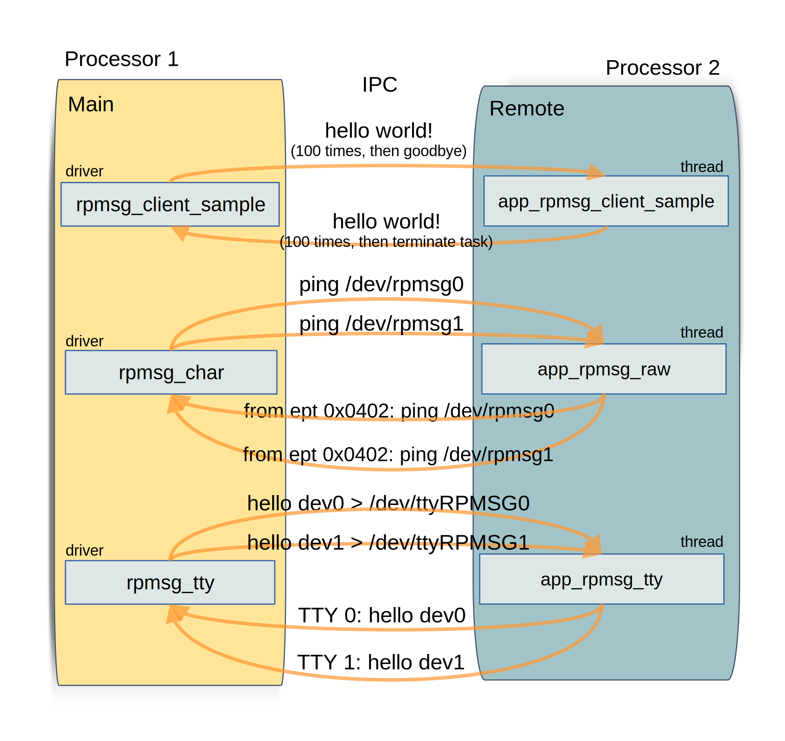

=================================
OpenAMP RPMsg Multi Services Demo
=================================

.. _rpmsg-multi-services-intro:

**************************
RPMsg Multi Services Intro
**************************

The RPMsg Multi Services reference sample demonstrates OpenAMP :ref:`Interprocessor Communications (IPC)<ipc-work-label>` components by providing multiple services on a single remote.

Three channel types are demonstrated.

* Direct RPMsg Channel
* Raw `character device <https://linux-kernel-labs.github.io/refs/heads/master/labs/device_drivers.html>`_ Channel
* `tty Device <https://www.kernel.org/doc/html/latest/driver-api/tty/index.html>`_ Channel

The host side is implemented in Linux as client drivers to the remote services. The Direct RPMsg driver is a dedicated demo driver and the character and tty RPMsg drivers are generic character drivers that can be used by any user space application through their respective device files.

.. _rpmsg-multi-services-components:

The linux rpmsg_client_sample driver begins sending 'hello world!' messages on a rpmsg_driver probe, and repeats a predefined time for each response from the remote. The response from the remote application is to return the same packet they received at the :ref:`RPmsg endpoint <rpmsg-endpoint>` from the host controller.

The character and tty driver are demonstrated by sending message to the rpmsg_char and rpmsg_tty driver respectively using the Linux echo command to the respective /dev/rpmsg? and /dev/ttyRPMSG? device files. The response is output by using the Linux cat command.

*******************************
RPMsg Multi Services Components
*******************************

The three :ref:`Interprocessor Communications (IPC)<ipc-work-label>` paths in this demonstration provide an identical application flow, namely a host based client sending packets via RPMsg to the remote which echoes the packet.

The main target of the demonstration is to show the different RPMsg types as supported by Linux drivers, namely 'direct', 'character' and 'tty' driver.

The underlying OpenAMP architectural components used by these applications are

* :ref:`Remoteproc<overview-remoteproc-work-label>`
* :ref:`Resource Table<overview-remoteproc-work-label>`
* :ref:`RPMsg<overview-rpmsg-work-label>`
* :ref:`Virtio<overview-rpmsg-work-label>`
* :ref:`Libmetal<overview-proxy-libmetal-label>`

The supporting Linux architectural components used by the drivers on the host side are

* `RPMsg character device <https://linux-kernel-labs.github.io/refs/heads/master/labs/device_drivers.html>`_
* `tty device <https://www.kernel.org/doc/html/latest/driver-api/tty/index.html>`_

The following architecture diagram shows the components involved in the demonstration.

..  image::  ../images/demos/rpmsg-multi-services-components.svg

The top-level control flow is shown in the following message diagram. The remote threads are show sequentially for clarity of diagram but could be executed in parallel.

********************************
RPMsg Multi Services Demo Source
********************************

RPMsg Multi Services Remote Source
==================================

The RPMSg implementation need not be on an RTOS (Real Time Operation System) but as there are multiple services being exposed, an RTOS is suitable as tasks or threads can be used for each service. If bare metal implementation is required, a round robin scheme could be used instead.

The current implementation is for the `Zephyr RTOS <https://docs.zephyrproject.org/latest/index.html>`_.

RPMsg Multi Services Zephyr Source
----------------------------------

The remote services are implemented as a single application, `main_remote.c <https://github.com/OpenAMP/openamp-system-reference/blob/main/examples/zephyr/rpmsg_multi_services/src/main_remote.c>`_, to run on the remote, with each service being a thread.

There are four threads. Three threads, one for each of the services ...

* app_rpmsg_client_sample
* app_rpmsg_tty
* app_rpmsg_raw

... and a main thread which starts the three service threads and monitors for requests for new end points on the "rpmsg-tty" channel.

* rpmsg_mng_task

RPMsg Multi Services Linux Source
=================================

The direct RPMsg client is a `dedicated Linux sample driver <https://github.com/torvalds/linux/blob/master/samples/rpmsg/rpmsg_client_sample.c>`_ specifically for demonstrations.

The raw character 'client' is the `RPMsg character driver <https://github.com/torvalds/linux/blob/master/drivers/rpmsg/rpmsg_char.c>`_ provided in the Linux source, and becomes available on a name service announcement from the remote whence the driver module is loaded and available at the /dev/rpmsg? device file. To exercise the demonstration, characters can be sent to the device file using the `rpmsg-utils/rpmsg_ping <https://github.com/OpenAMP/openamp-system-reference/blob/main/examples/linux/rpmsg-utils/rpmsg_ping.c>`_ command. The RPMsg device id name is "rpmsg-raw".

The tty 'client' is the `PRMsg tty driver <https://github.com/torvalds/linux/blob/master/drivers/tty/rpmsg_tty.c>`_ provided in the Linux source, and becomes available on a name service announcement from the remote whence the driver module is loaded and available at the /dev/ttyRPMSG? device file. To exercise the demonstration, characters can be sent to the device file using echo or cat Linux command.

*******************************
Reference Board Implementations
*******************************

This RPMsg Multi Services Sample is demonstrated in the following reference implementations.

* :ref:`ST Micro Platforms<demos-ST-work-label>`

Build and run instructions for reference board.
https://github.com/OpenAMP/openamp-system-reference/tree/main/examples/zephyr/rpmsg_multi_services

