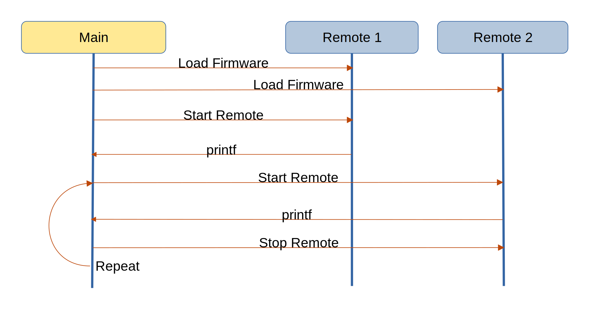

=======================
OpenAMP Split Mode Demo
=======================

.. _split-mode-intro:

****************
Split Mode Intro
****************

The `Split Mode Demo <https://github.com/OpenAMP/openamp-demo/tree/main/demos/demo-r5-split>`_ is provided to demonstrate the use of two remote processors independently. The example utilises two R5 processors in AMD Ultrascale's `split-mode <https://docs.amd.com/r/en-US/ug1085-zynq-ultrascale-trm/Normal-Split-Operation>`_, as compared to the default `lock-step mode <https://docs.amd.com/r/en-US/ug1085-zynq-ultrascale-trm/Lock-Step-Operation>`_ of the `RPU CPU Configuration <https://docs.amd.com/r/en-US/ug1085-zynq-ultrascale-trm/RPU-CPU-Configuration>`_.

.. _split-mode-components:

*********************
Split Mode Components
*********************

This demonstration uses a single application, sent independently to the two remotes, utilising a demo script on the main controller.

The underlying OpenAMP architectural components used by these applications are

* :ref:`Remoteproc<overview-remoteproc-work-label>`
* :ref:`Resource Table<overview-remoteproc-work-label>`
* :ref:`Libmetal<overview-proxy-libmetal-label>`

The following architecture diagram shows the components involved in the demonstration.

The top-level control flow is shown in the following message diagram.

.. _split-mode-control-flow:

.. _split-mode-remote-app:

Split Mode Remote Application
=============================

The remote application is a simple application which once loaded calls printf to write to the main
controller console, interleaved with other main controller console output.

.. _split-mode-linux-script:

Split Mode Main Script
======================

The main controller is responsible for loading the firmware and starting the remote processors by
writing start and stop to /sys/class/remoteproc/remoteproc0 and /sys/class/remoteproc/remoteproc1 alternately.

The script is available in the
:ref:`Demo Docker Images<docker-images-label>` as
`demo2 <https://github.com/OpenAMP/openamp-demo/blob/main/demos/demo-r5-combo/my-extra-stuff/home/root/demo2B>`_.

Split Mode Main Configuration
=============================

The remoteproc configuration binding
`cluster-mode <https://github.com/torvalds/linux/blob/master/Documentation/devicetree/bindings/remoteproc/xlnx%2Czynqmp-r5fss.yaml#L37>`_
is set to 0 for split-mode as per the
`system reference implementation <https://github.com/OpenAMP/openamp-system-reference/blob/main/examples/linux/dts/xilinx/zynqmp-split.dtso>`_.

************************************
Split Mode Remote Application Source
************************************

The application is deployed as binary in the :ref:`Demo Docker Images<docker-images-label>`
repository, and the source is derived from the
`echo-test <https://github.com/OpenAMP/openamp-system-reference/blob/main/examples/linux/rpmsg-echo-test/echo_test.c>`_
application, leaving out the RPMsg creation step and simply using LPRINTF to print the starting
message "Starting application on RPU0 and waiting for stop...".

*******************************
Reference Board Implementations
*******************************

This Split Mode Samples are demonstrated in the following reference implementations.

* :ref:`Docker Images<docker-images-label>` as demo2
