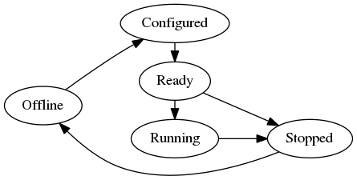

Remoteproc Design Document
===========================

Remoteproc provides abstraction to manage the life cycle of a remote
application. For now, it only provides APIs on bringing up and
tearing down the remote application, and parsing resource table.
It will extend to crash detection, suspend and resume.

Remoteproc LCM States
---------------------

.. csv-table::
   :header: "State", "State Description"
   :widths: 50, 200

    Offline, "Initial state of a remoteproc instance. The remote presented by the remoteproc instance and its resource has been powered off."
    Configured, "The remote presented by the remoteproc instance has been configured. And ready to load application."
    Ready, "The remote presented by the remoteproc instance has application loaded, and ready to run."
    Stopped, "The remote presented by the remoteproc instance has stopped from running. But the remote is still powered on. And the remote's resource hasn't been released."

State Transition
----------------

.. csv-table::
   :header: "State Transition", "Transition Trigger"
   :widths: 50, 200

    Offline -> Configured, "Configure the remote to make it able to load application :ref:`remoteproc_config<remoteproc_configure>`"
    Configured -> Ready, "load firmware :ref:`remoteproc_load<remoteproc_load>`"
    Ready -> Running, "start the processor :ref:`remoteproc_start<remoteproc_start>`"
    Ready -> Stopped, "stop the processor :ref:`remoteproc_stop<remoteproc_stop>`, :ref:`remoteproc_shutdown<remoteproc_shutdown>` (Stopped is the intermediate state of shutdown operation)"
    Running -> Stopped, "stop the processor :ref:`remoteproc_stop<remoteproc_stop>`, :ref:`remoteproc_shutdown<remoteproc_shutdown>`"
    Stopped -> Offline, "shutdown the processor :ref:`remoteproc_shutdown<remoteproc_shutdown>`"

Remote User APIs
----------------
.. _remoteproc_config:
Configure remote
^^^^^^^^^^^^^^^^

.. doxygenfunction:: remoteproc_config
   :project: openamp_doc_embed

Initialize remoteproc instance
^^^^^^^^^^^^^^^^^^^^^^^^^^^^^^^

.. doxygenfunction:: remoteproc_init
   :project: openamp_doc_embed

Release remoteproc instance
^^^^^^^^^^^^^^^^^^^^^^^^^^^

.. doxygenfunction:: remoteproc_remove
   :project: openamp_doc_embed

Add memory to remoteproc
^^^^^^^^^^^^^^^^^^^^^^^^

.. doxygenfunction:: remoteproc_add_mem
   :project: openamp_doc_embed

Get memory libmetal I/O region from remoteproc specifying memory name
^^^^^^^^^^^^^^^^^^^^^^^^^^^^^^^^^^^^^^^^^^^^^^^^^^^^^^^^^^^^^^^^^^^^^

.. doxygenfunction:: remoteproc_get_io_with_name
   :project: openamp_doc_embed

Get memory libmetal I/O region from remoteproc specifying physical address
^^^^^^^^^^^^^^^^^^^^^^^^^^^^^^^^^^^^^^^^^^^^^^^^^^^^^^^^^^^^^^^^^^^^^^^^^^

.. doxygenfunction:: remoteproc_get_io_with_pa
   :project: openamp_doc_embed

Get memory libmetal I/O region from remoteproc specifying virtual address
^^^^^^^^^^^^^^^^^^^^^^^^^^^^^^^^^^^^^^^^^^^^^^^^^^^^^^^^^^^^^^^^^^^^^^^^^

.. doxygenfunction:: remoteproc_get_io_with_va
   :project: openamp_doc_embed

Map memory and add the memory to the remoteproc instance
^^^^^^^^^^^^^^^^^^^^^^^^^^^^^^^^^^^^^^^^^^^^^^^^^^^^^^^^

.. doxygenfunction:: remoteproc_mmap
   :project: openamp_doc_embed

Set resource table to remoteproc
^^^^^^^^^^^^^^^^^^^^^^^^^^^^^^^^

.. doxygenfunction:: remoteproc_set_rsc_table
   :project: openamp_doc_embed

Configure the remote presented by the remoteproc instance to make it able to load application
^^^^^^^^^^^^^^^^^^^^^^^^^^^^^^^^^^^^^^^^^^^^^^^^^^^^^^^^^^^^^^^^^^^^^^^^^^^^^^^^^^^^^^^^^^^^^

.. doxygenfunction:: remoteproc_config
   :project: openamp_doc_embed

Load application to the remote presented by the remoteproc instance to make it ready to run
^^^^^^^^^^^^^^^^^^^^^^^^^^^^^^^^^^^^^^^^^^^^^^^^^^^^^^^^^^^^^^^^^^^^^^^^^^^^^^^^^^^^^^^^^^^

.. _remoteproc_load:
.. doxygenfunction:: remoteproc_load
   :project: openamp_doc_embed

Run application on the remote presented by the remoteproc instance
^^^^^^^^^^^^^^^^^^^^^^^^^^^^^^^^^^^^^^^^^^^^^^^^^^^^^^^^^^^^^^^^^^
.. _remoteproc_start:
.. doxygenfunction:: remoteproc_start
   :project: openamp_doc_embed

Stop application on remote presented by the remoteproc instance
^^^^^^^^^^^^^^^^^^^^^^^^^^^^^^^^^^^^^^^^^^^^^^^^^^^^^^^^^^^^^^^
.. _remoteproc_stop:
.. doxygenfunction:: remoteproc_stop
   :project: openamp_doc_embed

Shutdown the remote presented by the remoteproc instance
^^^^^^^^^^^^^^^^^^^^^^^^^^^^^^^^^^^^^^^^^^^^^^^^^^^^^^^^
.. _remoteproc_shutdown:
.. doxygenfunction:: remoteproc_shutdown
   :project: openamp_doc_embed

Create virtio device from the resource table vdev resource, and add it to the remoteproc instance
^^^^^^^^^^^^^^^^^^^^^^^^^^^^^^^^^^^^^^^^^^^^^^^^^^^^^^^^^^^^^^^^^^^^^^^^^^^^^^^^^^^^^^^^^^^^^^^^^

.. doxygenfunction:: remoteproc_create_virtio
   :project: openamp_doc_embed

Remove virtio device from the remoteproc instance
^^^^^^^^^^^^^^^^^^^^^^^^^^^^^^^^^^^^^^^^^^^^^^^^^

.. doxygenfunction:: remoteproc_remove_virtio
   :project: openamp_doc_embed
