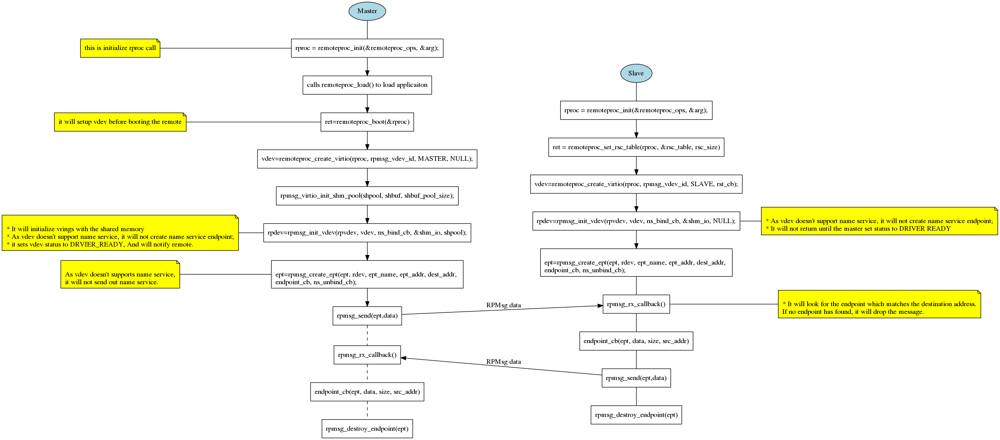
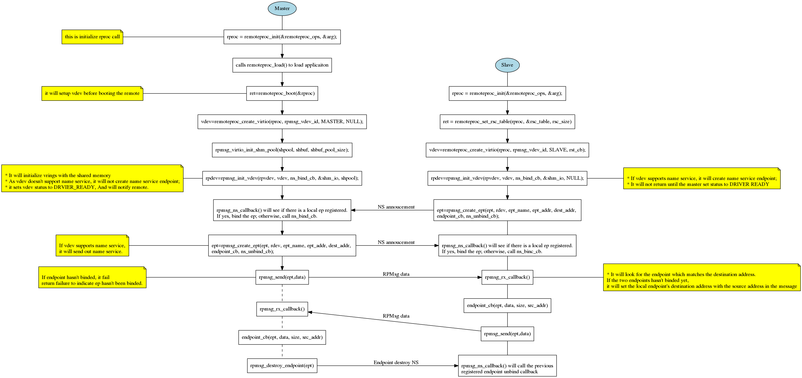
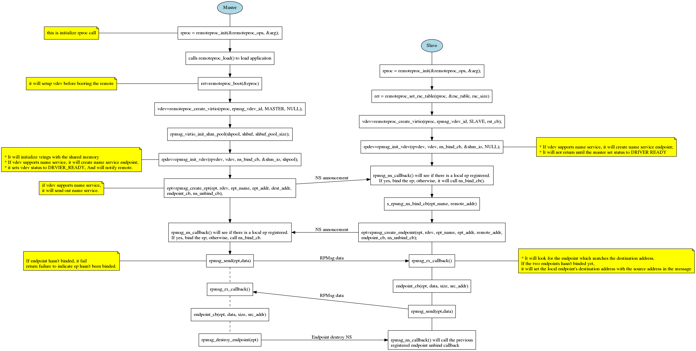

RPMsg Design Document
=====================
RPMsg is a framework to allow communication between two processors.
RPMsg implementation in OpenAMP library is based on virtio. It complies
the RPMsg Linux kernel implementation. It defines the handshaking on
setting up and tearing down the communication between applications
running on two processors.

RPMsg User API Flow Charts
--------------------------

RPMsg Static Endpoint
^^^^^^^^^^^^^^^^^^^^^

Binding Endpoint Dynamically with Name Service
^^^^^^^^^^^^^^^^^^^^^^^^^^^^^^^^^^^^^^^^^^^^^^

Creating Endpoint Dynamically with Name Service
^^^^^^^^^^^^^^^^^^^^^^^^^^^^^^^^^^^^^^^^^^^^^^^

RPMsg User APIs
---------------

.. doxygenfunction:: rpmsg_virtio_init_shm_pool
   :project: openamp_doc_embed

.. doxygenfunction:: rpmsg_init_vdev
   :project: openamp_doc_embed

.. doxygenfunction:: rpmsg_deinit_vdev
   :project: openamp_doc_embed

.. doxygenfunction:: rpmsg_virtio_get_rpmsg_device
   :project: openamp_doc_embed

RPMsg virtio endpoint APIs
^^^^^^^^^^^^^^^^^^^^^^^^^^

.. doxygenfunction:: rpmsg_create_ept
   :project: openamp_doc_embed

.. doxygenfunction:: rpmsg_destroy_ept
   :project: openamp_doc_embed

.. doxygenfunction:: is_rpmsg_ept_ready
   :project: openamp_doc_embed

RPMsg messaging APIs
^^^^^^^^^^^^^^^^^^^^

.. doxygenfunction:: rpmsg_send
   :project: openamp_doc_embed

.. doxygenfunction:: rpmsg_sendto
   :project: openamp_doc_embed

.. doxygenfunction:: rpmsg_send_offchannel
   :project: openamp_doc_embed

.. doxygenfunction:: rpmsg_trysend
   :project: openamp_doc_embed

.. doxygenfunction:: rpmsg_trysendto
   :project: openamp_doc_embed

.. doxygenfunction:: rpmsg_trysend_offchannel
   :project: openamp_doc_embed

.. doxygenfunction:: rpmsg_hold_rx_buffer
   :project: openamp_doc_embed

.. doxygenfunction:: rpmsg_release_rx_buffer
   :project: openamp_doc_embed

.. doxygenfunction:: rpmsg_get_tx_payload_buffer
   :project: openamp_doc_embed

.. doxygenfunction:: rpmsg_send_nocopy
   :project: openamp_doc_embed

.. doxygenfunction:: rpmsg_sendto_nocopy
   :project: openamp_doc_embed

.. doxygenfunction:: rpmsg_send_offchannel_nocopy
   :project: openamp_doc_embed

.. doxygenfunction:: rpmsg_release_tx_buffer
   :project: openamp_doc_embed

RPMsg User Defined Callbacks
----------------------------

* RPMsg endpoint message received callback:

.. doxygentypedef:: rpmsg_ept_cb
   :project: openamp_doc_embed

* RPMsg name service binding callback. If user defines such callback, when
  there is a name service announcement arrives, if there is no registered
  endpoint found to bind to this name service, it will call this callback.
  If this callback is not defined, it will drop this name service.:

.. doxygentypedef:: rpmsg_ns_bind_cb
   :project: openamp_doc_embed

* RPMsg name service unbind callback. If user defines such callback, when
  there is name service destroy arrives, it will call this callback.:

.. doxygentypedef:: rpmsg_ns_unbind_cb
   :project: openamp_doc_embed

* RPMsg endpoint name service unbind callback. If user defines such callback,
  when there is name service destroy arrives, it will call this callback to
  notify the user application about the remote has destroyed the service.:

.. doxygentypedef:: rpmsg_ns_unbind_cb
   :project: openamp_doc_embed
