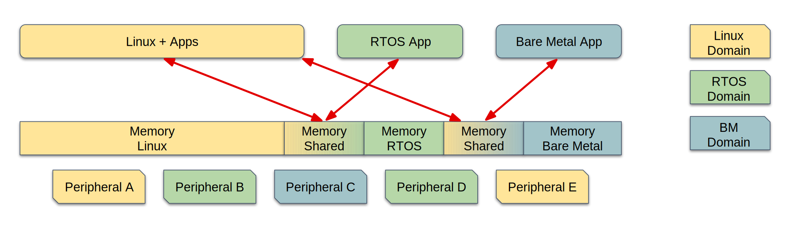
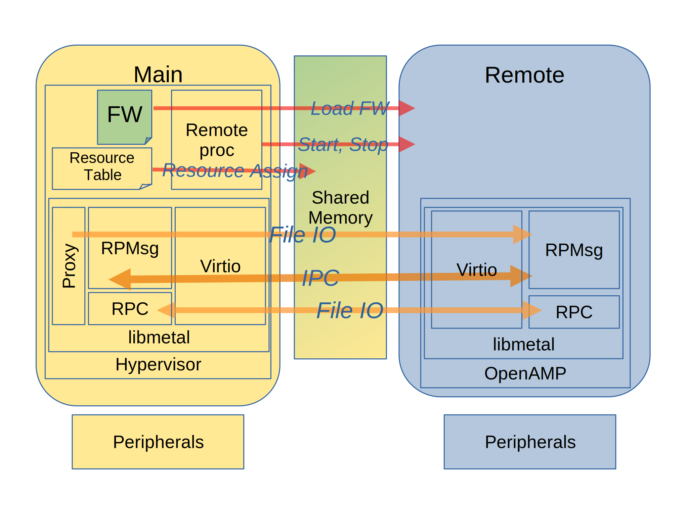

================
Project Overview
================

*************
OpenAMP Intro
*************

`Asymmetric Multiprocessing (AMP) <https://en.wikipedia.org/wiki/Asymmetric_multiprocessing>`_
involves the management, control and communication of multi-core computer systems, where processors
have independent tasks and are often in a
`heterogeneous <https://en.wikipedia.org/wiki/Heterogeneous_computing>`_ embedded environment where
there are different types of processors. This is in contrast to
`Symmetric Multiprocessing (SMP) <https://en.wikipedia.org/wiki/Symmetric_multiprocessing>`_ which
involves central control and load sharing using identical processor cores and is common place in
servers and desktop computers.

The **OpenAMP** project is a community effort that is promoting and implementing how these multiple
embedded systems interact with each other in an AMP environment. It provides conventions and open
source implementation to facilitate AMP development for embedded systems.

The vision is that regardless of the operating environment/operating system, it should be possible
to use identical interfaces to interact with other operating environments in the same system.

Furthermore, these operating environments can interoperate over a common protocol, making it
possible to mix and match any two or more operating systems in the same device.

Read more about Asymmetric Multiprocessing :ref:`here<asymmetric-multiprocessing-work-label>`.

*******
History
*******

Texas Instruments’ remoteproc and RPMsg infrastructure available in the upstream Linux kernel enable
the Linux applications running on a host processor to manage the life cycle of
remote processor/firmware and perform IPC with them. However, there was no open- source
API/software available that provided similar functionality and interfaces for other possible
software contexts (RTOS- or bare metal-based applications) running on the remote processor to
communicate with the Linux host. Also, AMP applications may require RTOS- or bare metal-based
applications to run on the host processor and be able to manage and communicate with various
software environments (RTOS, bare metal, or even Linux) on the remote processor.

The OpenAMP Framework fills these gaps. It provides the required LCM and IPC infrastructure from the
RTOS and bare metal environments with the API conformity and functional symmetry available in the
upstream Linux kernel. As in upstream Linux, the OpenAMP Framework's remoteproc and RPMsg
infrastructure uses virtio as the transport layer/abstraction.

************
Project Aims
************

To provide a solution to cover the :ref:`AMP Fundamentals<openamp-fundamentals-work-label>`, the
OpenAMP project is divided into the following efforts:

    * A guidance group under Linaro Community Projects
        - Provides guidance for the low-level protocol that allows systems to interact (:ref:`more info here<rpmsg-protocol-work-label>`)
            + Built on top of the `Virtio Open Standard <https://docs.oasis-open.org/virtio/virtio>`_
        - Maintaining common user level APIs that allow applications to be portable
            + :ref:`RPMSG<rpmsg-protocol-work-label>`
            + :ref:`remoteproc<lcm-work-label>`
        - **Provide low-level** :ref:`OS/HW abstraction layer<porting-guide-work-label>` APIs **that
          abstracts the open source implementation from the underlying OS and hardware, simplifying
          the porting to new environments**

    * An open source project that implements a clean-room implementation of OpenAMP
        - Runs in :ref:`multiple environments<operating-environments-work-label>`
        - BSD License

.. _openamp-fundamentals-work-label:

********************
OpenAMP Fundamentals
********************

There are some AMP fundamentals which influence the OpenAMP architecture.

* **Topology**: Different runtime systems need to coexist and collaborate as
  `Asymmetric Multiprocessing <https://en.wikipedia.org/wiki/Asymmetric_multiprocessing>`_ sets no
  restrictions on how systems can or should be utilized.
* **Resource Assignment**: Resources need to be assigned and shared into **runtime domains**.
* **Runtime Control**: Remote application/firmware loading, starting and stopping is required to
  manage the system.
* **IPC**: `Inter Processor Communications <https://en.wikipedia.org/wiki/Inter-process_communication>`_
  needs to be established to enable communication and control.
* **Resource Isolation**: AMP systems can be supervised (e.g. using a hypervisor) or unsupervised.

.. _topology-work-label:

Topology
========

The OpenAMP framework assumes a main controller to remote system architecture, but otherwise the
**topology** of the different runtime systems may be star, chain or a combination.

A main controller will control one or more remote cores each on a remote processor (star), and any
remote processor could also act as a controller to manage another set of cores on a different remote
processor (chain). Each remote could be an individual or multiple cores of a processor.

To exemplify, the following sections use diagrams detailing a star topology with a single Linux main
controller and dual remote cores, with one remote core running an RTOS and the other a bare metal
image. The choice of operating systems is arbitrary and just for this example.

.. _resource-assignment-work-label:

Resource Assignment
===================

This diagram details the Resource Assignment using a different color for each **runtime domain**.

..  image:: ../images/fundamentals/resource-assignment.svg

The yellow colored boxes are the Linux **runtime domain** as the main controller running on a single
processor, utilizing the two cores in a `Symmetric Multiprocessing <https://en.wikipedia.org/wiki/Symmetric_multiprocessing>`_
setup. The green and blue colored boxes details the RTOS and Bare Metal remote applications each
running on a single core of a remote processor as their own **runtime domain**. The Linux system
shares memory with both remotes, but the remote applications do not share memory. Each domain owns
independent peripherals in the system. Although the Linux domain is
`SMP <https://en.wikipedia.org/wiki/Symmetric_multiprocessing>`_, all three **runtime domains**
together make up an `AMP <https://en.wikipedia.org/wiki/Asymmetric_multiprocessing>`_ system.

.. _runtime-control-work-label:

Runtime Control
===============

..  image:: ../images/fundamentals/runtime-control.svg

With the domains defined, **runtime control** of the asymmetric remote applications can be started
to handle :ref:`Life Cycle Management (LCM)<lcm-work-label>` of the remotes. The main controller
will load and control the images as required. In this example the RTOS image could be loaded at
power on to perform say environmental instrument monitoring and the bare metal image on demand to
perform some specific high intensity calculations, but stopped on completion for power savings.
The control flow will be implementation specific.

.. _ipc-work-label:

Inter Processor Communications
==============================

`Inter Processor Communications <https://en.wikipedia.org/wiki/Inter-process_communication>`_ is
performed through shared memory and is between main controller and remote.
In the example, the IPC could be instrument updates from the RTOS remote to the Linux main controller
to display, and independently :ref:`Remote Procedure Calls (RPC)<overview-proxy-rpc-work-label>`
between the Linux main controller and the other, bare metal, remote responsible for resource
intensive calculations.

In this star topology example the remotes cannot communicate with each other. If that were required
a chain topology would be used instead to allow one remote to be both a remote and a main controller
in which case they could communicate (refer to :ref:`Architecture Section<openamp-architecture-work-label>`
for an example).

.. _resource-isolation-work-label:

Resource Isolation
==================

Resources isolation is not essential, but the ability to utilise a supervisor, such as a hypervisor,
to enforce isolation and allow virtualization is an important fundamental for the
:ref:`OpenAMP Architecture<openamp-architecture-work-label>` to allow, as some implementations may
have it as a safety requirement.

.. _openamp-architecture-work-label:

********************
OpenAMP Architecture
********************

The OpenAMP framework utilizes a number of distinct components to achieve the
:ref:`OpenAMP Fundamentals<openamp-fundamentals-work-label>`, with most of them using or derived
from existing standards or frameworks.

The components comprising OpenAMP are:

.. csv-table::
   :header: "AMP Component", "AMP Fundamentals"
   :widths: 50, 60

    :ref:`Remoteproc<overview-remoteproc-work-label>`, Resource Assignment and Runtime Control
    Resource Table, Resource Assignment
    :ref:`RPMsg<overview-rpmsg-work-label>`, IPC
    :ref:`Virtio<overview-rpmsg-work-label>`, Hypervisor and Hardware Abstraction
    :ref:`Proxy<overview-proxy-rpc-work-label>`, IPC for File Input Output (IO)
    :ref:`Libmetal<overview-proxy-libmetal-label>`, Hardware Abstraction

The :ref:`topology<topology-work-label>` is limited to main controller to remote system but otherwise
open to the implementation.

The architecture is exemplified below via a daisy chained topology, with a main processor
controlling a single remote in the chain. This implements the left half of the daisy chain
topology detailed in the :ref:`OpenAMP Fundamentals<openamp-fundamentals-work-label>` section, and
is the commonly implemented topology.

In an attempt to keep the diagrams clear, not all OpenAMP components are drawn on each processor.

.. _overview-remoteproc-work-label:

RemoteProc
==========

:ref:`Runtime Control<runtime-control-work-label>` is part of the
:ref:`Life Cycle Management (LCM)<lcm-work-label>` of the remote(s) and performed through the
:ref:`remoteproc<lcm-work-label>` component which allows for the loading of the firmwares to the
remote processor and starting and stopping the remote.

:ref:`Resource Assignment<resource-assignment-work-label>` is also achieved through the
:ref:`remoteproc<lcm-work-label>` component utilizing a Resource Table, which provides the memory
and peripheral allocation as well as information for establishing the IPC between associated
processors.

.. _overview-rpmsg-work-label:

RPMsg and Virtio
================

Standardization of the IPC is promoted by the OpenAMP project through the use of
:ref:`RPMsg <rpmsg-protocol-work-label>`, using `Open Standard Virtio Devices <https://docs.oasis-open.org/virtio/virtio>`_
as a HW abstraction or MAC layer.

This abstraction, using virtio, means that the implementer can optionally use
:ref:`resource isolation<resource-isolation-work-label>` (e.g. using a hypervisor or secure
context), which is exemplified by the first processor in the architecture diagram.

.. _overview-proxy-rpc-work-label:

RPMsg Services
==============

OpenAMP provides higher level IPC components as RPMsg Services. There is a Remote Procedure Cal
(RPC) service and Proxy service.

The proxy provides file IO on the remote allowing access to the filesystem on the main controller.
This provides a mechanism for remotes to access files occasionally without having to introduce a
full filesystem on the remote. In the architecture diagram the center processor remote proxies file
IO from its main controller on the left.

The RPC service provides for remote procedure calls from a server to a client. In the architecture
diagram the right hand processor has the RPC server servicing the center main controller processor's
RPC client.

.. _overview-proxy-libmetal-label:

Libmetal
========

:doc:`Libmetal <../libmetal/readme>` is a hardware abstraction component, intended to provide for
portability across different platforms.
Vendors porting OpenAMP will provide an implementation of libmetal for their system.

.. _project-aims-work-label:

Read more about the OpenAMP System Components :ref:`here<openamp-components-work-label>`.

.. _operating-environments-work-label:

**********************
Operating Environments
**********************

OpenAMP aims to provide components which are portable and aim to be environment agnostic.

-The result is that OpenAMP is supported in various operating environments through
  - an `OpenAMP open source project <https://github.com/OpenAMP>`_,
  - an OpenAMP Linux Kernel project, coming through the regular
    `remoteproc <https://www.kernel.org/doc/html/latest/staging/remoteproc.html>`_/
    `RPMsg <https://www.kernel.org/doc/html/latest/staging/rpmsg.html>`_/
    `Virtio <https://docs.kernel.org/driver-api/virtio/virtio.html>`_ efforts in the kernel.
  - multiple proprietary implementations.

The operating environments that OpenAMP supports include:

  - Linux user space
  - Linux kernel
  - Multiple RTOS's - including `FreeRTOS <https://freertos.org/>`_, `NuttX <https://nuttx.apache.org/>`_, `Zephyr <https://www.zephyrproject.org/>`_, `VxWorks <https://www.windriver.com/products/vxworks>`_, and more
  - Bare Metal (No OS)
  - In OS's on top of hypervisors
  - Within hypervisors

.. _governance-work-label:

*********************************
OpenAMP Governance and Guidelines
*********************************

The OpenAMP Project governance is detailed on the
`OpenAMP Project Page <https://www.openampproject.org/governance/>`_.

There are a few guiding principles that governs OpenAMP:

    - Provide a clean-room implementation of OpenAMP with business friendly APIs and licensing
        * Allow for compatible proprietary implementations and products
    - Base as much as possible on existing technologies/open source projects/standards
        * In particular :ref:`remoteproc<lcm-work-label>`, :ref:`RPMsg <rpmsg-protocol-work-label>`
          and `virtio <https://docs.oasis-open.org/virtio/virtio>`_
    - **Never standardize on anything unless there is an open source implementation that can prove it**
    - Always be backwards compatible (unless there is a really, really good reason to change)
        * In particular make sure to be compatible with the Linux kernel implementation of
          :ref:`remoteproc<lcm-work-label>`/
          :ref:`RPMsg <rpmsg-protocol-work-label>`/`Virtio <https://docs.oasis-open.org/virtio/virtio>`_

There are a number of project members as outlined in
`OpenAMP Project Page <https://www.openampproject.org/about/>`_ as well as many community members,
so please join the :ref:`OpenAMP open source project<openamp-maintenance-work-label>`!
    - See https://github.com/OpenAMP/open-amp
