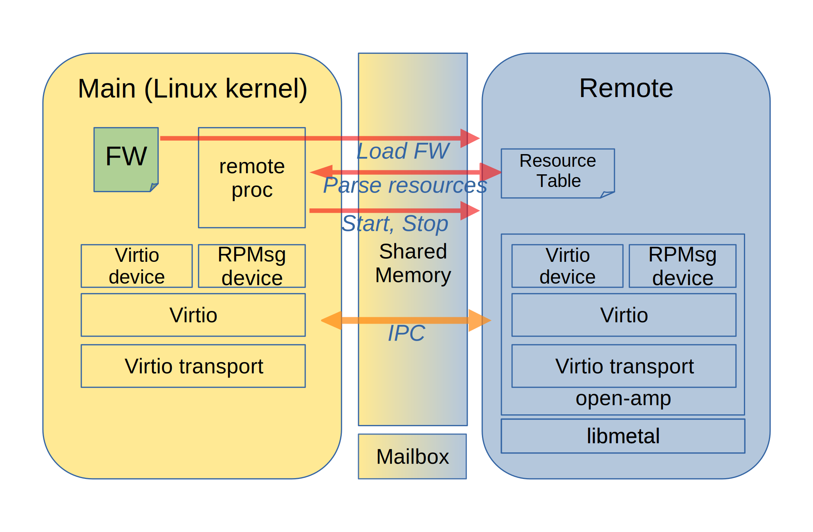

================
Project Overview
================

*************
OpenAMP Intro
*************

`Asymmetric Multiprocessing (AMP) <https://en.wikipedia.org/wiki/Asymmetric_multiprocessing>`_ involves the management, control and communication of multiple computer systems, where processors have independent tasks and are often in a `heteregenous <https://en.wikipedia.org/wiki/Heterogeneous_computing>`_ embedded environment where there are different types of processors. This is in contrast to `Symmetric Multiprocessing (SMP) <https://en.wikipedia.org/wiki/Symmetric_multiprocessing>`_ which involves central control and load sharing using identical processor cores and is common place in servers and desktop computers.

The **OpenAMP** project is a community effort that is standardizing and implementing how these multiple embedded systems interact with each other in an AMP environment. It provides conventions and standards as well as an open source implementation to facilitate AMP development for embedded systems.

The vision is that regardless of the operating environment/operating system, it should be possible to use identical interfaces to interact with other operating environments in the same system.

Furthermore, these operating environments can interoperate over a standardized protocol, making it possible to mix and match any two or more operating systems in the same device.

Read more about Asymmetric Multiprocessing :ref:`here<asymmetric-multiprocessing-work-label>`.

.. _openamp-fundamentals-work-label:

********************
OpenAMP Fundamentals
********************

There are some AMP fundamentals which influence the OpenAMP architecture.

* **Topology**: Different runtime systems need to coexist and collaborate as `Asymmetric Multiprocessing <https://en.wikipedia.org/wiki/Asymmetric_multiprocessing>`_ sets no restrictions on how systems can or should be utilized.
* **Resource Assignment**: Resources need to be assigned and shared into **run time domains**
* **Runtime Control**: Remote application/firmware loading, starting and stopping is required to manage the system.
* **IPC**: `Inter Processor Communications <https://en.wikipedia.org/wiki/Inter-process_communication>`_ needs to be established to enable communication and control.
* **Resource Isolation**: AMP systems can be supervised (using a hypervisor) or unsupervised.

.. _topology-work-label:

Topology
========

The OpenAMP framework assumes a master-slave system architecture, but otherwise the **topology** of the different runtime systems may be star, chain or a combination.

.. image:: ../images/topo_types.jpg

A master will control one or more slaves each on a remote processor (star), and any remote processor could also act as a master to control another slave on a different remote processor (chain).

To exemplify, the following sections use diagrams detailing a star topology with a single Linux master and dual slaves, with one remote running an RTOS and the other a bare metal image. The choice of operating systems is arbitrary and just for this example.

.. _resource-assignment-work-label:

Resource Assignment
===================

This diagram details the Resource Assignment using a different color for each **runtime domain**.

..  image:: ../images/fundamentals/resource-assignment.svg

The yellow colored boxes are the Linux **runtime domain** as the master running on a single processor, utilizing the two cores in a `Symmetric Multiprocessing <https://en.wikipedia.org/wiki/Symmetric_multiprocessing>`_ setup, and the green and blue colored boxes details the RTOS and Bare Metal slave applications each running on a single core of a remote processor as their own **runtime domain**. The Linux system shares memory with both slaves, but the slave applications do not share memory. Each domain owns independent peripherals in the system. Although the Linux domain is `SMP <https://en.wikipedia.org/wiki/Symmetric_multiprocessing>`_, all three **runtime domains** together make up an `AMP <https://en.wikipedia.org/wiki/Asymmetric_multiprocessing>`_ system.

.. _runtime-control-work-label:

Runtime Control
===============

With the domains defined, **runtime control** of the asymmetric slave applications can be started. The master will load the images as required. In this example the RTOS image could be loaded at power on to perform say environmental instrument monitoring and the bare metal image on demand to perform some specific high intensity calculations, but stopped on completion for power savings.

.. _ipc-work-label:

Inter Processor Communications
==============================

..  image::  ../images/fundamentals/ipc.svg

`Inter Processor Communications <https://en.wikipedia.org/wiki/Inter-process_communication>`_ is performed through shared memory and is between master and slave. In this star topology example the slaves cannot communicate with each other. If that were required a chain topology would be used instead to allow one remote to be both a slave and a master in which case they could communicate (refer to :ref:`Architecture Section<openamp-architecture-work-label>` for an example).

.. _resource-isolation-work-label:

Resource Isolation
==================

Resources are shared, so the ability to utilise a supervisor, such as a hypervisor, to enforce isolation is an important consideration for the :ref:`OpenAMP Architecture<openamp-architecture-work-label>`, as some implementations may have it as a safety requirement.

.. _openamp-architecture-work-label:

********************
OpenAMP Architecture
********************

The OpenAMP architecture or framework utilizes a number of distinct components to achieve the :ref:`OpenAMP Fundamentals<openamp-fundamentals-work-label>`, with most of them using or derived from existing standards or frameworks. Additionally a hardware abstraction component, libmetal, provides for portability across different platforms.

The components comprising OpenAMP are

.. csv-table::
   :header: "AMP Component", "AMP Fundamentals"
   :widths: 50, 60

    Remoteproc, Resource Assignment and Runtime Control
    Resource Table, Resource Assignment
    RPMsg, IPC
    Virtio, Hypervisor and Hardware Abstraction
    Proxy, IPC for File Input Output (IO)
    Remote Procedure Call (RPC) Service, IPC
    Libmetal, Hardware Abstraction

The :ref:`Topology<topology-work-label> is limited to master-slave but otherwise open to the implementation.

The architecture is exemplified below via a daisy chained topology, with the center processor being both slave and master for the next processor in the chain.

In an attempt to keep the diagrams clear, not all OpenAMP components are drawn on each processor.

:ref:`Runtime Control<runtime-control-work-label>` is part of the :ref:`Life Cycle Management (LCM)<lcm-work-label>` of the remote(s) and performed through the remoteproc component which allows for the loading of the firmwares to the remote processor and starting and stopping the remote.

:ref:`Resource Assignment<resource-assignment-work-label>` is also achieved through the remoteproc component utilizing a Resource Table, which provides the memory and peripheral allocation as well as information for establishing the IPC between associated processors.

Standardization of the IPC is promoted by the OpenAMP project through the use of :ref:`RPMsg <rpmsg-protocol-work-label>`, using `Open Standard Virtio devices <https://docs.oasis-open.org/virtio/virtio/v1.3/virtio-v1.3.html>`_ as a HW abstraction or MAC layer. The abstraction using Virtio means that the implementer can optionally use :ref:`Resource Isolation<resource-isolation-work-label>` via a hypervisor, which is exemplified by the first processor in the architecture diagram. The other two processors are in what is referred to as a hypervisorless-virtio setup because they are using virtio (virtual io) as an abstraction layer but without a hypervisor.

The OpenAMP Proxy and RPC Service are higher level IPC components.

The proxy provides file IO on the remote allowing access to the filesystem on the master. This provides a mechanism for remotes to access files occasionally without having to introduce a full filesystem on the remote. In the architecture diagram the center processor slave proxy's file IO from its master on the left.

The RPC service provides for remote procedure calls from a server to a client. In the architecture diagram the right hand processor has the RPC server servicing the center master processor's RPC client.

Read more about the OpenAMP System Components :ref:`here<openamp-components-work-label>`.

In the future OpenAMP is envisioned to also encompass other areas important in a heterogeneous environment, such as power management and managing the lifecycle of non-CPU devices.

.. _project-aims-work-label:

************
Project Aims
************

To provide a solution to cover the :ref:`AMP Fundamentals<openamp-fundamentals-work-label>` the OpenAMP project is divided into the following efforts:

    * A standardization group under Linaro Community Projects
        - Standardizing the low-level protocol that allows systems to interact (:ref:`more info here<rpmsg-protocol-work-label>`)
            + Built on top of the `Virtio Open Standard <https://docs.oasis-open.org/virtio/virtio/v1.3/virtio-v1.3.html>`_
        - Standardizing on the user level APIs that allow applications to be portable
            + :ref:`RPMSG<rpmsg-protocol-work-label>`
            + :ref:`remoteproc<lcm-work-label>`
        - Standardizing on the low-level :ref:`OS/HW abstraction layer<porting-guide-work-label>` that abstracts the open source implementation from the underlying OS and hardware, simplifying the porting to new environments

    * An open source project that implements a clean-room implementation of OpenAMP
        - Runs in :ref:`multiple environments<operating-environments-work-label>`
        - BSD License

.. _operating-environments-work-label:

**********************
Operating Environments
**********************

OpenAMP aims to provide components which are portable and aim to be environment agnostic.

The result is that OpenAMP is supported in various operating environments through an a) `OpenAMP open source project (OAOS) <https://github.com/OpenAMP/open-amp>`_, b) a Linux kernel project (OALK), and c) multiple proprietary implementations (OAPI). The Linux kernel support (OALK) comes through the regular `remoteproc <https://www.kernel.org/doc/html/latest/staging/remoteproc.html>`_/`RPMsg <https://www.kernel.org/doc/html/latest/staging/rpmsg.html>`_/`Virtio <https://docs.kernel.org/driver-api/virtio/virtio.html>`_ efforts in the kernel.

The operating environments that OpenAMP supports include:

    - Linux user space - OAOS
    - Linux kernel - OALK
    - Multiple RTOS's - OAOS/OAPI including `Nucleus <https://resources.sw.siemens.com/en-US/fact-sheet-nucleus-rtos>`_, `FreeRTOS <https://freertos.org/>`_, `uC/OS <https://www.osrtos.com/rtos/uc-os-iii/>`_, `VxWorks <https://www.windriver.com/products/vxworks>`_, `Zephyr <https://www.zephyrproject.org/>`_ and more
    - Bare Metal (No OS) - OAOS
    - In OS's on top of hypervisors - OAOS/OAPI
    - Within hypervisors - OAPI

.. _governance-work-label:

*********************************
OpenAMP Governance and Guidelines
*********************************

The OpenAMP Project governance is detailed on the `OpenAMP Project Page <https://www.openampproject.org/governance/>`_.

There are a few guiding principles that governs OpenAMP:

    - Provide a clean-room implementation of OpenAMP with business friendly APIs and licensing
        * Allow for compatible proprietary implementations and products
    - Base as much as possible on existing technologies/open source projects/standards
        * In particular remoteproc, RPMsg and virtio
    - Never standardize on anything unless there is an open source implementation that can prove it
    - Always be backwards compatible (unless there is a really, really good reason to change)
        * In particular make sure to be compatible with the Linux kernel implementation of remoteproc/RPMsg/virtio

There are a number of project members as outlined in `OpenAMP Project Page <https://www.openampproject.org/about/>`_ as well as many community members, so please join the :ref:`OpenAMP open source project<openamp-maintenance-work-label>`!
    - See https://github.com/OpenAMP/open-amp

If you want to contribute and port OpenAMP to your platform read more about OpenAMP porting :ref:`here<porting-guide-work-label>`.
