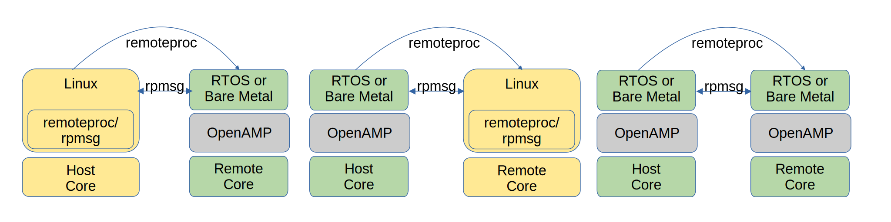

.. _openamp-components-work-label:

===========================
Components and Capabilities
===========================

The key components, and the capabilities they provide, of the OpenAMP Framework include:

.. toctree::
   :maxdepth: 2

   lifecyclemgmt
   rpmsg

+-------------------+--------------------------------------------------------------------------------+
| AMP Key Component |                                  Description                                   |
+===================+================================================================================+
| remoteproc        | This component allows for the Life Cycle Management (LCM) of remote processors |
|                   | from software running on a host processor. The remoteproc API provided by the  |
|                   | OpenAMP Framework is  compliant with the remoteproc infrastructure present in  |
|                   | upstream Linux 3.4.x kernel onward.                                            |
+-------------------+--------------------------------------------------------------------------------+
| RPMsg             | The RPMsg API enables                                                          |
|                   | `Inter Processor Communications (IPC)                                          |
|                   | <https://en.wikipedia.org/wiki/Inter-process_communication>`_                  |
|                   | between independent software contexts running on homogeneous or                |
|                   | `heterogeneous <https://en.wikipedia.org/wiki/Heterogeneous_computing>`_ cores |
|                   | present in an AMP system. This API is compliant with the RPMsg bus             |
|                   | infrastructure present in upstream Linux 3.4.x kernel onward. The Linux RPMsg  |
|                   | bus and API infrastructure was first implemented by Texas Instruments          |
+-------------------+--------------------------------------------------------------------------------+

**********
Topologies
**********

The following figure shows the various software environments/configurations supported by the OpenAMP
Framework. As shown in this illustration, the OpenAMP Framework can be used with RTOS or bare metal
contexts on a remote processor to communicate with Linux applications (in kernel space or user
space) or other RTOS/bare metal-based applications running on the host processor through the
remoteproc and RPMsg components.

The OpenAMP Framework also serves as a stand-alone library that enables RTOS and bare metal
applications on a host processor to manage the life cycle of remote processor/firmware and
communicate with them using RPMsg.

*************
Proxy and RPC
*************

In addition to providing a software framework/API for LCM and IPC, the OpenAMP Framework supplies a
proxy infrastructure that provides a transparent interface to remote contexts from Linux user space
applications running on the host processor. The proxy application hides all the logistics involved
in bringing-up the remote software context and its shutdown sequence. In addition, it supports
RPMsg-based Remote Procedure Calls (RPCs) from the remote context. A retargeting API available
from the remote context allows C library system calls such as "_open", "_close", "_read", and
"_write" to be forwarded to the proxy application on the host for service.

***********
Abstraction
***********

In addition to the core capabilities, the OpenAMP Framework contains abstraction layers
(porting layer) for migration to different software environments and new
target processors/platforms, through its libmetal library.
