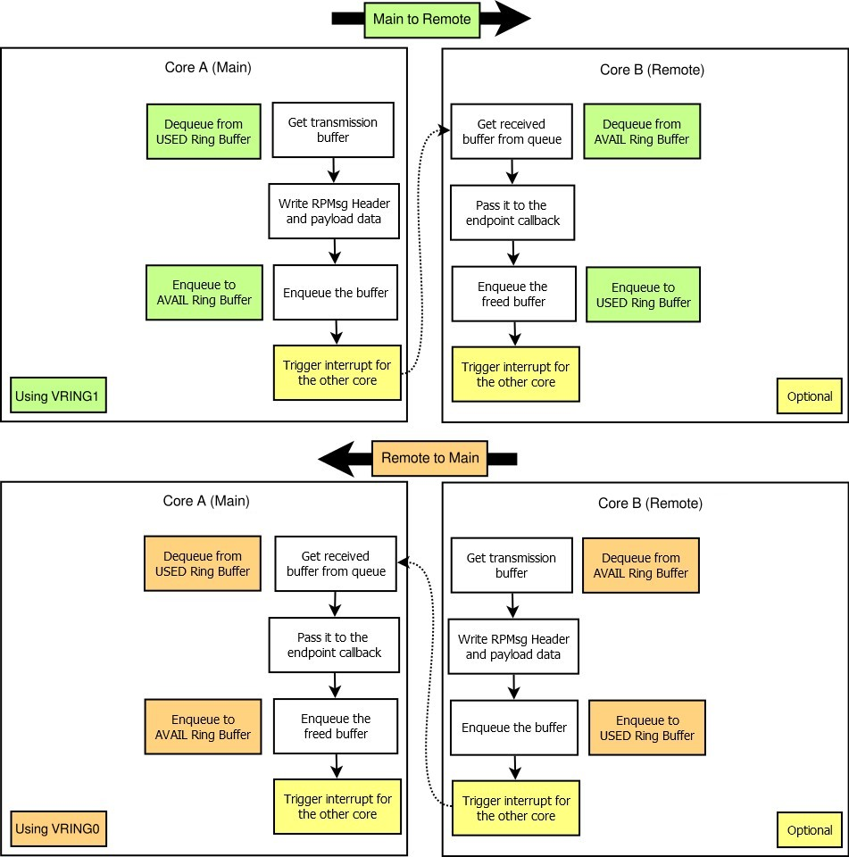

=========================
RPMsg Communication Flow
=========================

The following figure describes the sequence used for transaction of a RPMsg message from one core
to the other.
The sequence differs according to the roles of core A and core B. In the figure above, core A is
the main controller and core B is the remote. The main controller allocates buffers used for
the transmission from the “used” ring buffer of a vring, writes RPMsg Header and application
payload to it and then enqueues it to the “avail” ring buffer.

The remote core gets the received RPMsg buffer from the “avail” ring buffer, processes it and then
returns it back to the “used” ring buffer. When the remote core is sending a message to the main
controller, “avail” and “used” ring buffers role are swapped.

The reason for swapping the roles of the ring buffers comes from the fact, that the main core
works as a Buffer Provider. The Buffer Provider has complete control of memory management and
shared memory allocation. Obviously, when the main controller, or Buffer Provider, does not fill
the “avail” ring buffer of VRING0 (Orange), the Remote core is unable to send a message to the
main controller.
This can be used to throttle the communication generated by the Remote core. It is to be noticed,
that the main controller always dequeues from the “used” ring buffer and enqueues to the “avail”
ring buffer.
For the remote, the situation is inverse.

The triggering of interrupts is optional. It is governed
by the flags in “used” and “avail” ring buffers.
