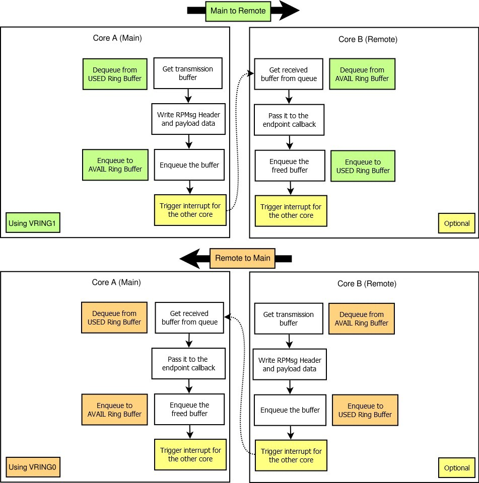

=========================
RPMsg Communication Flow
=========================

This section details the communication flow for the :ref:`media access layer<rpmsg-protocol-mac>`
of RPMsg Protocol, in the transmit (main to remote) and receive (remote to main) directions.

Two :ref:`VRINGs<rpmsg-protocol-figure-vring>` are used, each with its own available and used
ring buffers and associated descriptors. VRING1 for transmit and VRING0 for receive.

The
`Virtio RPMsg bus vring allocation <https://github.com/torvalds/linux/blob/master/drivers/rpmsg/virtio_rpmsg_bus.c#L878.>`_,
is an example implementation where the main controller is running Linux and where VRING0 is vqs[0]
or the receive (rvq) VRING and VRING1 is vqs[1] or the transmit/send (svq) VRING.

Transmit RPMsg flow (main to remote)
------------------------------------

For the transmission of RPMsgs from the main controller to the remote, the following actions
are performed against the transmit VRING (VRING1), as detailed in the top of the flow chart
below:

The main controller

* Gets a transmission buffer from the used queue of VRING1.
* Writes the RPMsg header and payload of this buffer.
* Enqueues this buffer containing the RPMsg to the available queue of VRING1 by setting the head
  index.
* Optionally triggers an interrupt to inform remote of message availability.

  * if F_NO_NOTIFY flag is not set in available ring buffer

The remote then

* Gets the received buffer from the available queue of VRING1.
* Passes the buffer to the endpoint callback, which would handle the message.
* Enqueues the freed buffer to the used queue of VRING1, to make it available again for
  future transmissions from the main controller.
* Optionally triggera an interrupt to inform main controller of freed buffer.

  * if F_NO_NOTIFY flag is not set in used ring buffer

Receive RPMsg flow (remote to main)
-----------------------------------

For the transmission of RPMsgs from the remote to the main controller (receive flow) the
following actions are performed on the receive VRING (VRING0), as detailed in the lower part
of the flow chart above.

The remote

* Gets a transmission buffer from the available queue of VRING0.
  * The main controller can throttle remote messages by withholding the available buffer.
* Writes the RPMsg header and payload of this buffer.
* Enqueues this buffer containing the RPMsg to the used queue of VRING0 by setting the head
  index.
* Optionally triggers an interrupt to inform the main controller of message availability.

  * if F_NO_NOTIFY flag is not set in used ring buffer.

The main controller then

* Gets the received buffer from the used queue of VRING0.
* Passes the buffer to the endpoint callback, which would handle the message.
* Enqueues the freed buffer to the available queue of VRING0, to make it available again for
  future transmissions from the remote.
* Optionally triggers an interrupt to inform the remote of freed buffer.

  * if F_NO_NOTIFY flag is not set in used ring buffer.

Summary
-------

The remote gets the received RPMsg buffer from the available ring buffer, processes it and
then returns it back to the used ring buffer. When the remote is sending a message to the
main controller, available and used ring buffer roles are swapped.

The reason for swapping the roles of the ring buffers stems from the main controller being the
buffer provider. The buffer provider has complete control of memory management and shared memory
allocation.
When the main controller, or buffer provider, does not fill the available ring buffer of
VRING0, the remote is unable to send a message to the main controller.
This can be used to throttle the communication generated by the remote.

It is to be noticed, that the main controller always dequeues from the used ring buffer and
enqueues to the available ring buffer.

The triggering of interrupts is optional. It is governed by the F_NO_NOTIFY flag in used and
available ring buffer flags. The use of notification interrupts is recommended for
performance reasons, and defaults to this as the flag is clear. The user can overwrite
this by setting this flag if there are particular reasons to poll for messages rather than use
interrupts.
