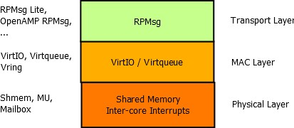
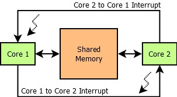
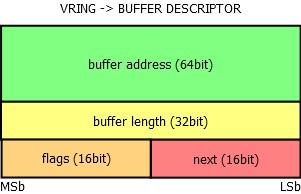
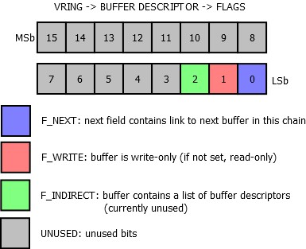
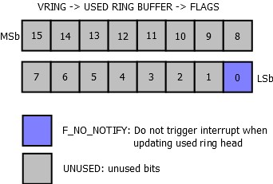
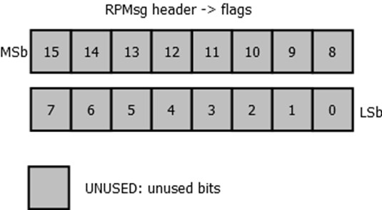

.. _rpmsg-protocol-work-label:

=====================
RPMsg Protocol Layers
=====================

The whole communication implementation can be separated in three different ISO/OSI layers

 - Transport,
 - Media Access Control,
 - Physical layer.

Each of them can be implemented separately and for example multiple implementations of the
Transport Layer can share the same implementation of the MAC Layer (VirtIO) and the Physical Layer.
Each layer is described in the following sections.

Physical Layer – Shared Memory
------------------------------

The solution proposed in this document requires only two basic hardware components

- shared memory (accessible by both communicating sides) 
- inter-core interrupts (optional in a specific configuration). The minimum configuration requires
  one interrupt line per communicating core meaning two interrupts in total.

This configuration is briefly presented in the figure at the beginning of this section. It is to be
noticed that no inter-core synchronization hardware element such as inter-core semaphore, inter-core
queue or inter-core mutex is needed! This is thanks to the nature of the
`virtqueue <https://docs.oasis-open.org/virtio/virtio/v1.3/csd01/virtio-v1.3-csd01.html#x1-270006>`_,
which uses single-writer-single-reader circular buffering. (As defined in the next subsection).

The use of interrupts by the ring buffers is optional and can be suppressed using a bit set in their
configuration flags field - in such a configuration, the interrupts are not necessary. However both
cores need to poll these ring buffers for new incoming messages, which may not be optimal.

Media Access Layer - VirtIO
---------------------------

This layer is the key part of the whole solution - thanks to this layer, there is no need for
inter-core synchronization. This is achieved by a technique called single-writer single-reader
circular buffering, which is a data structure enabling multiple asynchronous contexts to
interchange data.

.. image:: ../images/vrings.jpg

This technique is however applicable only in core-to-core configuration, not in core-to-multicore
configuration, since in such a case, there would be multiple writers to the “IN” ring buffer.
This would require a synchronization element, [such as a semaphore?], which is not desirable.

The above shown picture describes the vring component. The Vring is composed of three elementary
parts - buffer descriptor pool, the available ring buffer and the used ring buffer. All three
elements are physically stored in the shared memory.

Each buffer descriptor contains a 64-bit buffer address, which holds an address to a buffer stored
in the shared memory (as seen physically by the “receiver” or host of this vring), its length as a
32-bit variable, 16-bit flags field and 16-bit link to the next buffer descriptor. The link is used
to chain unused buffer descriptors and to chain descriptors, which have the F_NEXT bit set in the
flags field to the next descriptor in the chain.

Note that the available and used ring buffer areas contain pointers to buffers, rather than the
buffers themselves. Later versions of the
`Virtio virtqueue <https://docs.oasis-open.org/virtio/virtio/v1.3/csd01/virtio-v1.3-csd01.html#x1-270006>`_
have changed the naming of these three sections to Descriptor Table, Driver Area and Device Area.

The available ring buffer contains its own flags field, where only the 0th bit is used - if it is
set, the “writer” side should not be notified, when the “reader” side consumes a buffer from the
available ring buffer. By default the bit is not set, so after the reader consumes a buffer, the
writer should be notified by triggering an interrupt. The next field of the available ring buffer
is the index of the head, which is updated by the writer, after a buffer index containing a new
message is written in the ring[x] field.

   Flags (16 bit) Fields of Available Ring Buffer Descriptor

The last part of the vring is the used ring buffer. It contains also a flags field and only the 0th
bit is used - if set, the writer side will not be notified when the reader updates the head index of
this used ring buffer. The following picture shows the ring buffer structure. The used ring buffer
differs from the available ring buffer. For each entry, the length of the buffer is stored as well.

.. image:: ../images/vrings_used_buffers.jpg

Both used and available ring buffers have a flags field. Its purpose is mainly to tell the writer
whether he should interrupt the other core when updating the head of the ring. The same bit is used
for this purpose in both used and available ring buffers:

Transport Layer - RPMsg
-----------------------
RPMsg Header Definition
~~~~~~~~~~~~~~~~~~~~~~~

Each RPMsg message is contained in a buffer, which is present in the shared memory. This buffer is
pointed to by the address field of a buffer descriptor from the vring’s buffer descriptor pool. The
first 16 bytes of this buffer are used internally by the transport layer (RPMsg layer). The first
word (32bits) is used as an address of the sender or source endpoint, the next word is the address
of the receiver or destination endpoint. There is a reserved field for alignment reasons (RPMsg
header is thus 16 bytes aligned). The last two fields of the header are the length of the payload
(16bit) and a 16-bit flags field. The reserved field is not used to transmit data between cores and
can be used internally in the RPMsg implementation. The user payload follows the RPMsg header.

.. image:: ../images/rpmsg_header.jpg

Special consideration should be taken if an alignment greater than 16 bytes is required; however,
this is not typical for a shared memory, which should be fast and is therefore often not cached
(alignment greater than 8 bytes is not needed at all).

Flags Field
~~~~~~~~~~~

The flags field of the RPMsg header is currently unused by RPMsg and is reserved. Any propositions
for what this field could be used for are welcome. It could be released for application use, but
this can be considered as inconsistent - RPMsg header would not be aligned and the reserved field
would be therefore useless.

RPMsg Channel
~~~~~~~~~~~~~

Every remote core in the RPMsg component is represented by an RPMsg device that provides a
communication channel between the host and the remote, hence RPMsg devices are also known as
channels. The RPMsg channel is identified by the textual name and local (source) and destination
address. The RPMsg framework keeps track of channels using their names.

.. _rpmsg-endpoint:

RPMsg Endpoint
~~~~~~~~~~~~~~

RPMsg endpoints provide logical connections on top of an RPMsg channel. They allow the user to bind
multiple rx callbacks on the same channel.

Every RPMsg endpoint has a unique src address and associated call back function. When an application
creates an endpoint with the local address, all further inbound messages with the destination
address equal to the local address of endpoint are routed to that callback function. Every channel
has a default endpoint which enables applications to communicate without even creating new endpoints.

.. image:: ../images/rpmsg_endpoint.jpg

**************************
RPMsg Protocol Limitations
**************************

    The RPMSG document has the concept of the static channel but it is not implemented in upstream
    Linux and OpenAMP. Please see https://www.kernel.org/doc/Documentation/rpmsg.txt. The protocol
    must define the connection sequence when the channel is created statically.
    No synchronization point is defined by the RPMsg framework after which both sides can
    communicate reliably with each other. In the current protocol, at startup, the host sends a
    notification to the remote to let it know that it can receive name service announcements.
    However, the host does not consider whether the remote is ready to handle notification at this
    point in time.
