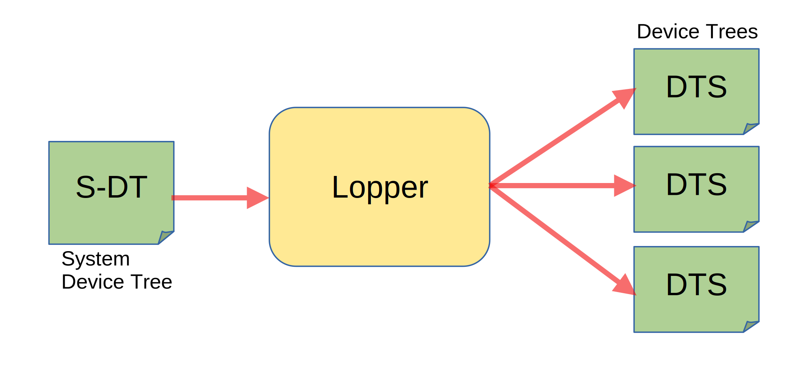
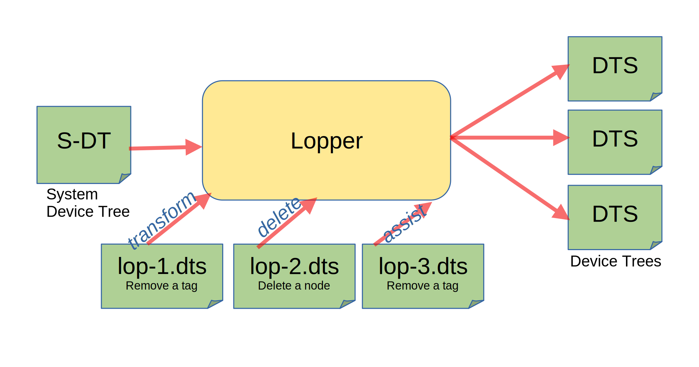

===================
OpenAMP Lopper Tool
===================

.. _lopper-tool-intro:

***************
Lopper Intro
***************

System Device Trees (S-DT) are used to describe resources of `heterogeneous <https://en.wikipedia.org/wiki/Heterogeneous_computing>`_ embedded environments.

Their intent is to be the industry standard method for defining how computing resources are divided into independent :ref:`runtime domains<resource-assignment-work-label>`.

Examples of domains are

* a computing unit, e.g. RTOS on R5s
* an operating environment at a specific execution level (e.g. `OPTEE <https://optee.readthedocs.io/en/latest/general/about.html>`_)
* a virtual machine (e.g. `Xen <https://xenproject.org/>`_)

For those familiar with `Device Trees (DTS) <https://www.kernel.org/doc/html/latest/devicetree/usage-model.html>`_ think of the S-DT as a combination of multiple device trees to define sub-systems. DTS' define resources seen from one address space, whereas S-DT's define the topology of the full system.

The `Lopper Tool <https://github.com/devicetree-org/lopper>`_ provides a way to generate sub-system DTS' from S-DT's and manipulate, inspect or verify the S-DT for correctness.

The `Lopper Tool <https://github.com/devicetree-org/lopper>`_ is a data driven tool written in Python, and supports inputs in dts, dtb and yaml format. Actions, which are used to manipulate the input data, are provided as unit operations (lops) as DTS formatted files. These are small transformation commands, inline Python source or for more complex scenarios `lopper assists <https://github.com/devicetree-org/lopper/tree/master/lopper/assists>`_ Python modules.

The diagram below shows an example of three transformations performed by lopper through three independent DTS files which define the actions to perform.

Lopper is built on top of device tree tools, `Device Tree Compiler (DTC) <https://github.com/torvalds/linux/tree/master/scripts/dtc>`_ and `libfdt <https://github.com/torvalds/linux/tree/master/scripts/dtc/libfdt>`_.

References
^^^^^^^^^^

:ref:`Lopper Architecture Readme<lopper/README-architecture:lopper processing flow:>`

`Linaro Connect 2020 - System Device Tree & Lopper Slide Set <https://static.linaro.org/connect/lvc20/presentations/LVC20-314-0.pdf>`_

`Open Source Summit 2022 Slide Set <https://static.sched.com/hosted_files/ossna2022/d9/Lopper%20ELCNA%202022.pdf>`_
